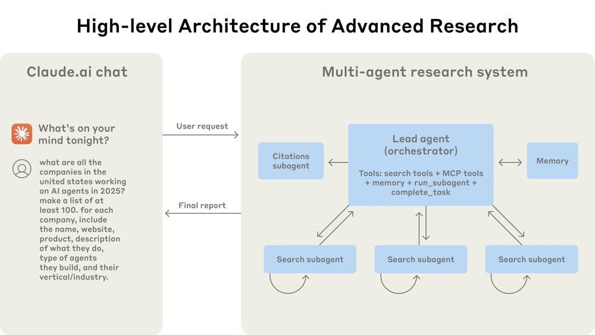

# Product Overview

**Cognify** the **Content Generation and Trend Insight Engine** is a self-driving content platform that monitors an area of interest, discovers hot topics automatically, and generates high-quality long-form articles (complete with charts and images) ready for publication. It blends autonomous AI agents, retrieval and analysis from diverse data sources, and automated formatting/publishing. Given a domain (e.g. “cybersecurity”) it will continuously scan trend signals (Google Trends, Reddit, X, GitHub, news feeds, arXiv, etc.), select trending topics, run in-depth multi-agent research, synthesize insights, write structured articles, embed relevant visuals, and output blog-ready content (Markdown/HTML) that can be pushed to platforms like LinkedIn, Substack, Medium, or WordPress.

# Problem Statement

Manually identifying new topics and writing polished, insightful articles is labor-intensive and slow. Researchers and content teams often miss fast-emerging trends or take hours per article. AI research agents have shown they can compress hours of human research into minutes, but no turnkey open-source solution currently handles the entire workflow end-to-end for publishing. We need a fully automated pipeline that (1) finds trending topics in a niche, (2) autonomously gathers and digests relevant information from the web, (3) composes a comprehensive article with structure and citations, (4) generates charts/infographics and illustrative images, and (5) formats and exports content for publishing — all without constant manual intervention.

# Target Users / Personas

- **Tech Content Teams**: Marketers, bloggers, and product marketers needing timely articles on industry trends. They want to publish insights rapidly to keep up with competition.  
- **Independent Researchers / Consultants**: Subject-matter experts or consultants who want a personal assistant to gather the latest info and draft reports.  
- **Product Managers / CTOs**: Technical leaders, who want to automate content marketing or thought leadership to drive SEO and engagement. They need a system that handles end-to-end generation without deep AI expertise.  
- **Media Publishers**: Small media outlets or niche news sites looking to scale content creation in specific verticals with limited editorial resources.

# Key Features

- **Trending Topic Discovery**: Continuously monitor multiple signals (e.g. Google Trends, Reddit, Hacker News, Twitter/X, GitHub Trending, news APIs, arXiv updates) to rank emerging topics in the domain. For example, Google’s new Trends API (alpha release) provides real-time search interest data.  
- **Autonomous Multi-Agent Research**: Once a topic is selected, use a multi-agent AI framework where a lead agent orchestrates sub-agents. Each sub-agent performs web search, query databases, and retrieves documents in parallel. The system supports multi-step reasoning and retrieval-augmented pipelines (RAG) to gather high-quality information.  
- **Information Synthesis & Citation**: Combine findings, cross-reference sources, and ensure all claims are cited. Outputs are documented with source attributions, similar to ChatGPT’s Deep Research mode which “documents everything with clear citations”.  
- **Long-form Article Generation**: Generate full-length articles (thousands of words) with outlines, sections, and narrative flow. The system can “break the LLM token limit” to produce 2K+ word reports. It should understand SEO (target keywords, headings), how search agents works and craft engaging content.  
- **Visual Asset Creation**: Automatically produce charts, diagrams, and images for the article. This includes programmatic charts (via Matplotlib, Vega/Altair, Chart.js) and infographics (e.g. using AntV Infographic’s declarative engine), as well as AI-generated illustrations (nano banana, Stable Diffusion, DALL·E) for concepts that benefit from imagery.  
- **Formatting & Multi-Platform Output**: Format the content in Markdown or HTML, include captions, and publish through APIs. For instance, use Ghost’s Content API or WordPress REST API to push posts. The output pipeline should target multiple destinations (LinkedIn Articles, Substack, Medium import, Ghost/WordPress) with correct formatting and metadata (tags, cover image, SEO meta tags).

# System Architecture

The engine follows a modular pipeline architecture built on agent orchestration. An **Orchestrator (Lead) Agent** receives a query or topic and devises an approach. It spawns **Specialized Sub-Agents** for tasks like web searching, database querying, or code execution, running them in parallel. This multi-agent pattern (illustrated below) greatly expands context capacity and parallelizes work.

*Figure: High-level multi-agent architecture. A lead agent orchestrates specialized subagents (searchers, analyzers, writers) to explore different facets of a query concurrently.*

In practice, a *Trending Detector* component first fetches signals (via APIs or scraping) to identify hot topics. The chosen topic is fed to the Lead Agent, which uses an LLM to plan research steps and allocate subtasks. Each subagent may call search engines (Google/Bing API), news APIs (NewsAPI/GNews), or fetch documents (arXiv RSS) as needed. Retrieved data goes into a **Retrieval-Augmented Pipeline (RAG)**: documents are indexed (e.g. in Pinecone or Weaviate) and relevant chunks are passed to agents for summarization. The agents iteratively refine the answer. Once information is gathered, the *Synthesis Module* merges insights and forms the draft. Finally, a *Formatting/Export* module converts the draft to the target format and pushes it out via platform APIs.

Key data stores include: a cache or vector store for retrieved knowledge, a memory log for the orchestrator, and logs for each agent’s steps. The diagram above (Figure) embodies this flow: queries enter the system, the LeadResearcher agent plans and saves its strategy to memory, spawns multiple Search Agents that call tools, and aggregates their findings into the final report. This layered architecture allows easy scaling (e.g. adding more subagents or tools) and clear separation of concerns.

# Agent Workflow Design

We design agent workflows as a sequence of autonomous steps. Initially, a *Trend Agent* collects trending terms (from Google Trends, social media, news). For each selected trend, we kick off an **Research Workflow**. This begins with a *Literature Agent* that conducts a domain-specific literature review (using APIs like arXiv and Semantic Scholar). Next, a *Plan Agent* forms an outline or experiment plan. Then one or more *Search Agents* gather web content and data (news articles, StackOverflow threads, code repos). Finally, a *Write Agent* composes the article.
 

*Figure: Example agent workflow (Agent Laboratory). Specialized agents (research assistant, ML engineer, etc.) collaborate: one reviews literature, another drafts experiments, another writes the report*.  

Throughout, agents specialize by role. For example, one agent might focus on data collection (using search tools), another on summarization and reasoning, and a final agent on draft writing. This “crew” model (as in CrewAI) mirrors human team roles. Agents use intermediate memory: the orchestrator keeps a persistent plan, and subagents save findings in shared stores. After each phase, the Lead Agent re-assesses if more work is needed or if it should finalize the output. This looping, stepwise approach ensures thoroughness.

The figure above (from Agent Laboratory) illustrates how agents collaborate across phases. In the literature review phase, agents scour papers and summarize key points. In the experiment phase, an “MLE-solver” agent might generate or execute code and analyze results (Agent Lab’s approach). Finally, a “Paper-solver” agent writes the coherent report from accumulated insights. This structured workflow (cite: Agent Lab documentation) makes the process transparent and modifiable.

# Data Pipeline

The data pipeline ingests **trend signals** and **knowledge sources**:

- **Trend Signals**: We poll APIs and feeds for current hot topics. For example, Google’s new Trends API (in preview) lets us query interest over time. We also scrape “top” pages on Reddit and Hacker News, use Twitter/X trending keywords, and monitor GitHub’s trending repos by category. News APIs (NewsAPI, Currents) provide recent headlines. We filter and rank these to pick topics within the configured domain. 
- **Knowledge Retrieval**: Once a topic is chosen, the agents fetch relevant content: web search (via SerpAPI), specialized databases (e.g. StackExchange for technical topics), and scientific feeds (arXiv, IEEE) if research context is needed. All retrieved documents are indexed into an internal knowledge base (vector DB).  
- **Preprocessing**: Text from sources is cleaned (remove boilerplate), chunked, and embedded for similarity search. We may also extract metadata (dates, authors). This structured data flows into the RAG pipeline.  
- **Feedback Loop**: The system logs which sources/queries were most useful, enabling a learning mechanism. Over time, it can adjust focus (e.g. prioritize certain sites or types of content for better results).

In short, we continuously transform raw signals into structured knowledge. This pipeline feeds the agents’ decision-making and ensures the content is grounded in up-to-date information.

# Content Generation Pipeline

With data in hand, the content pipeline generates text. It typically runs two chained agent flows: an *Outline/Structure Agent* and a *Drafting Agent*. First, the Outline Agent uses an LLM to create an article outline or set of section headings based on the topic and retrieved context. Then, the Drafting Agent generates each section: it pulls in relevant retrieved passages (RAG), cites facts, and writes prose. This might be done iteratively: after drafting, an Evaluation Agent checks coherence and instructs for refinements if needed.

For example, GPT Researcher explicitly supports generating very long reports beyond standard token limits. We’ll leverage similar techniques (breaking the task into chunks, using memory for context) to produce thousands of words. Throughout writing, we incorporate SEO keywords (via a built-in keyword module) and ensure readability. Tools like LangChain can orchestrate these steps: LangChain provides abstractions for chains of LLM calls and supports looping with memory.

Post-generation, the content is automatically polished: grammar/clarity improvements (via a dedicated LLM or grammar API), and SEO tuning (checking keyword placement). The final output is a structured document (Markdown or HTML) with headings, lists, etc. This pipeline can be parameterized (e.g., target article length, tone). 

# Visual Asset Generation Pipeline

Visuals are added to support and illustrate the content. The pipeline here includes:

- **Data Visualization**: For any data or statistics, the system generates charts. For example, given user-provided data (or collected stats), it can call Python plotting libraries (Matplotlib, Altair/Vega) to auto-create line charts, bar charts, or network diagrams. Tools like Chart.js (via scripts) or Google Charts can also be used. Alternatively, declarative engines like AntV Infographic enable generating infographics from templates.
- **Diagrams/Flowcharts**: For conceptual content, the system might generate diagrams using libraries like GraphViz or Mermaid (graph syntax) to visualize relationships. For instance, architecture diagrams can be auto-produced with Python or Mermaid scripts.
- **AI-Generated Illustrations**: For topics needing illustrative images, we integrate generative models (e.g. DALL·E, Stable Diffusion). The agents craft prompts and call these APIs to create thematic images (e.g., an “AI researcher at computer” or an infographic summarizing a concept).  
- **Layout Integration**: Once images/charts are produced, the pipeline formats them with captions and places them in the Markdown/HTML content at contextually relevant points.

This pipeline runs at the end of the writing phase or interleaved with it. For example, if the agents discuss a statistic, a Chart Agent can be invoked to render that figure. These visuals make the articles richer and more engaging.

# Publishing & Formatting System

After content and images are assembled, the system formats them for publishing. It supports multi-format export:

- **Markdown/HTML Output**: Core output is Markdown (with embedded images and HTML where needed). This ensures portability. Optionally, Pandoc can convert Markdown to PDF or rich HTML.
- **Platform Integration**: The engine uses APIs to push content to blog platforms. For Ghost or WordPress (both open-source), we can use their REST admin APIs. (For Ghost: its Content API serves posts in JSON, and the Admin API allows creating posts.) Medium has a developer API for programmatic posting, and LinkedIn’s Marketing API can publish articles on a LinkedIn page. For Substack, we can email-post or use their API.  
- **SEO Metadata**: Titles, descriptions, and tags are auto-generated (agents choose SEO-optimal phrasing). The system also manages images (sets a featured image) and ensures formatting (e.g. markdown links, lists).
- **Review & Scheduling**: Optionally, articles can be reviewed via a simple UI or queued. The system may post immediately or schedule per the user’s preference.

For users wanting a standalone site, the content could be automatically deployed with a static site generator (e.g. Hugo/Jekyll) or a Markdown-based CMS like *Markdown Ninja*. Markdown Ninja is an open-source Markdown-first CMS for blogs and newsletters, enabling easy publishing by committing Markdown. In summary, the formatting subsystem ensures the outputs are “publication-ready” in whatever channel the user wants.

# Recommended Tech Stack

- **Language/Frameworks**: Python (for agents and pipelines), Node.js (for any frontend if needed).  
- **Agent Framework**: LangChain (with LangGraph) LangChain’s ecosystem (Open Deep Research, LangGraph) is mature.  
- **LLMs**: GPT-4o (Claude), LLaMA-4, or open models like Mistral 8x, for generation. Use open-source models for private deployment if needed (fine-tune on domain).  
- **Retrieval/Indexing**: Vector DB (Pinecone, Weaviate, or LlamaIndex framework) for embeddings/RAG. Elasticsearch for text search.  
- **Data Libraries**: Haystack or LlamaIndex to glue retrieval+LLM (Haystack offers agent workflows and pipelines).  
- **Visual Tools**: Matplotlib, Plotly, AntV Infographic. Stable Diffusion/DALL·E API for images. Mermaid/GraphViz for diagrams.  
- **Publishing**: Ghost (Node.js CMS, MIT-licensed) for hosting with API, WordPress for broad compatibility, or static site via Hugo/Jekyll.  
- **API Integrations**: Google Trends API, Reddit API (PRAW), HackerNews Algolia API, GitHub REST (for trending repos), News API/GNews, arXiv API.  
- **Infrastructure**: Cloud deployment on AWS/GCP. Kubernetes or serverless functions to run agents and pipelines. Dockerize agent services.

# Open Source Projects to Build On

1. **GPT Researcher**: A top-ranked autonomous research agent. It supports multiple LLMs, web search, local doc ingestion, multi-agent modes, and can generate very long reports【61†L138-L146】【61†L153-L156】. It is widely adopted (25k★) and excels at deep research tasks.
2. **LangChain & LangGraph**: A mature LLM framework (129k★) with support for chaining LLM calls, memory, RAG, and tools【63†L299-L307】. LangGraph (built on LangChain) adds stateful multi-agent orchestration for complex workflows【28†L245-L253】. LangChain’s “Open Deep Research” is a configurable research agent with 10.8k★【66†L278-L282】.
3. **AutoGPT**: A highly popular 182k★ project for running continuous GPT agents【62†L325-L334】. It offers a CLI, workflow management, and examples (like generating content from Reddit trends【62†L444-L452】). However, its license is mixed (agent code MIT, some platform parts Polyform). It’s useful for prototypes.
4. **CrewAI**: A 45k★ Python framework focusing on role-based multi-agent collaboration【96†L290-L298】【97†L1-L8】. It lets you define agents by roles/tasks (e.g. Researcher, Analyst, Writer) in YAML. CrewAI is optimized for production use and high performance.
5. **Agent Laboratory**: (MIT, 5.4k★) An end-to-end research assistant by academic authors【85†L19-L27】【103†L477-L485】. It orchestrates literature review, experiments, and report writing with specialized agents, showing the viability of the workflow.
6. **Haystack (deepset)**: A 24.5k★ pipeline framework for building RAG and agent applications【110†L334-L342】. It offers modular retrieval, memory, and tool-use. Good for production-grade retrieval and QA systems.
7. **LlamaIndex (GPT-Index)**: A 47.6k★ framework for connecting LLMs to private data【106†L168-L176】【68†L21-L28】. It simplifies indexing of docs, SQL, APIs, code. Useful for the knowledge base layer.
8. **AutoGen (Microsoft)**: A 55k★ agentic framework supporting Python/.NET, for building autonomous workflows【98†L10-L18】. It can be used to rapidly prototype custom agents.

# Ready-Made Open Source Platforms

- **AUTO-blogger**: A turnkey WordPress automation tool (MIT licensed) that combines AI writing, SEO, and images. It scrapes source content, uses Google Gemini/OpenAI to rewrite SEO-optimized posts, generates DALL·E images, and pushes to WordPress. It demonstrates an integrated pipeline (content+image+SEO).  
- **Markdown Ninja**: A Go-based Markdown-first CMS (MIT) for blogs/newsletters. It streamlines publishing via Git/Markdown. Not AI-specific, but useful for output.  
- **Ghost**: An open-source blogging platform with a full API. It can serve as the publishing endpoint (via its RESTful content/admin API) and is extensible with themes.  
- **Hugo/Jekyll**: Static site generators (open source) for producing HTML sites from Markdown. They can be part of the pipeline to publish static blogs to GitHub Pages or similar.  
- **None fully-integrated**: There isn’t a single open project that does trend discovery→research→article generation end-to-end. The above components would need to be orchestrated.

# Comparison Table of Solutions

| Solution                    | Type               | Core Capabilities                                              | License      | Community           | Strengths                                                     | Weaknesses                            |
| --------------------------- | ------------------ | -------------------------------------------------------------- | ------------ | ------------------- | ------------------------------------------------------------- | ------------------------------------- |
| **GPT Researcher**          | Autonomous Agent   | Multi-step research agent with RAG, multi-search, long reports | Apache-2.0   | Large (25k★)        | Powerful deep research, long outputs【61†L153-L156】            | Complex, needs LLM compute            |
| **AutoGPT**                 | Framework/Agent    | Continuous agent workflows; has UI/CLI, knowledge base support | MIT/Polyform | Massive (182k★)     | Very flexible; many examples (trend-to-content)【62†L444-L452】 | Can be unpredictable; license caveats |
| **LangChain**               | Framework Library  | Chains, tools, memory, agents, RAG                             | MIT          | Large (129k★)       | Highly extensible, plugin ecosystem                           | Steeper learning curve                |
| **LangGraph (LC)**          | Ext. of LangChain  | Graph-based multi-agent orchestration, stateful workflows      | MIT          | Moderate (internal) | Explicit flow control, stateful                               | Newer, less community docs            |
| **Open Deep Research (LC)** | Research Agent     | Open-config deep research agent (LangChain-based)              | MIT          | 10.8k★              | Plug-and-play research agent                                  | Limited customization                 |
| **CrewAI**                  | Framework Library  | Role-based multi-agent “crew” model (YAML config, flows)       | MIT          | Growing (45k★)      | Structured team dynamics【64†L369-L378】                        | Smaller ecosystem, new                |
| **Agent Laboratory**        | End-to-End System  | Full research pipeline (lit review, experiment, writing)       | MIT          | Niche (5.4k★)       | Academic-grade workflow structure【85†L19-L27】                 | Experimental; GPU requirements        |
| **Haystack**                | Pipeline Framework | Modular RAG, QA, agents, multimodal, LLM-agnostic              | Apache-2.0   | 24.5k★              | Production-ready pipelines【110†L334-L342】                     | Less focus on generative content      |
| **LlamaIndex**              | Data Connectors    | Index/query diverse data sources for LLMs                      | MIT          | 47.6k★              | Excellent for data integration【68†L21-L28】                    | Not an end-to-end agent itself        |
| **AutoGen**                 | Framework          | Multi-agent app framework (Python/.NET)                        | MIT          | 55.5k★              | Official MS library, solid design                             | Relatively new, multi-license docs    |

This table contrasts **modular frameworks/agents** (left) with **integrated tools** (not listed above). The frameworks (bottom rows) require assembly but offer flexibility; the more “productized” agents (top rows) are closer to turn-key in their niche. For example, AUTO-blogger (see platforms above) would be an integrated solution for WordPress SEO, while GPT Researcher or LangChain require orchestration to solve the whole pipeline. 

# MVP Scope

For an initial version, focus on a single domain and a core pipeline:  

- Implement **Trend Discovery** from one or two sources (e.g. Google Trends and Reddit top posts) to pick topics.  
- Integrate a **research agent** based on a framework (e.g. GPT Researcher or LangChain’s Open Deep Research) to fetch and synthesize data for a topic.  
- Generate an **outline and draft** using an LLM (via LangChain or AutoGPT example agents). Keep it simple (few sections).  
- Generate at least one **chart or image** via a Python library (e.g. a Matplotlib chart) and one AI illustration (Stable Diffusion).  
- Format output as Markdown and **publish to one platform**, such as a Ghost blog (using Ghost API).  
- Include basic SEO (title, meta tags) and a review step (console output) before publishing.  
This MVP would validate core automation without full polish (e.g. manual review of first article may be allowed).

# Future Enhancements

- **Broader Trend Signals**: Add more data sources (Twitter, GitHub trending, academic feeds). Incorporate user feedback to weight signals.  
- **Advanced Agents**: Develop more specialized roles (e.g. Code-Execution Agent for data analysis, News-Summarizer agent). Allow agents to write rebuttals or compare viewpoints.  
- **Interactive Config**: A UI where users can specify tone, keywords, or reject topics mid-process.  
- **Continuous Learning**: Use feedback (e.g. article engagement metrics) to tune future content (ML-based topic ranking).  
- **Multilingual Support**: Publish in multiple languages by connecting to translation engines or multilingual LLMs.  
- **Pluggable LLMs**: Support custom or fine-tuned models. Offer on-premises deployment for privacy.  
- **Rich Media**: Generate videos or slide decks from articles (beyond images). Integrate with Canva-like design.  
- **Collaboration Features**: Allow multiple user accounts or teams, with review/comment before publishing.  
- **SEO Automation**: Integrate full SEO tooling (keyword analysis, performance tracking, backlink suggestions) as part of the pipeline.

# Risks and Mitigations

- **Content Accuracy & Hallucination**: LLMs may produce inaccurate or outdated info. *Mitigation:* Rely on retrieval-of-fact sources and enforce citation of each fact. Implement a fact-checking pass or use specialized factuality models. As OpenAI notes, deep-research outputs should be fully cited. A human-in-the-loop review step can catch errors.  
- **Bias and Misleading Tone**: Generated content might reflect model biases or use sensational language. *Mitigation:* Train agent prompts with guidelines for neutrality and clarity. Include a “style-check” agent or rules enforcing an objective tone.  
- **Copyright and Plagiarism**: Even with citation, summarization of copyrighted text can be an issue. *Mitigation:* Use tools to detect near-duplicate text. Restrict scraping to permissible sources. Attribute all quotes and avoid verbatim copying.  
- **Overfitting to Trends**: The system might churn out content that’s formulaic or too generic. *Mitigation:* Encourage agents to add unique insights (e.g. citing novel analysis or combining uncommon sources). Limit repetitiveness by tracking what’s already published.  
- **Dependency Failures**: Relying on external APIs (e.g. Google Trends, Twitter) can break if endpoints change. *Mitigation:* Abstract data sources and have fallbacks. Cache critical data. Monitor integrations and alert on errors.  
- **Ethical/Legal Compliance**: Auto-generated content might inadvertently violate platform policies (e.g. banned topics) or contain defamation. *Mitigation:* Build filters to avoid disallowed content. Have a legal/ethics review for sensitive topics.  
- **Resource Consumption**: Running many LLM calls and image generators can be costly. *Mitigation:* Optimize with caching, limit the number of sub-agents, and choose efficient models (e.g. use smaller models for drafts, bigger models for final pass).  
- **User Trust**: End-users may not trust fully automated content. *Mitigation:* Clearly mark AI-generated content where required. Include references and a summary of the agent’s process (transparency report). Optionally, allow collaboration where a human editor can adjust the draft.

By addressing these risks — through verification, human oversight, and careful system design — we ensure the pipeline produces reliable, high-quality content that can safely go live on publishing platforms.