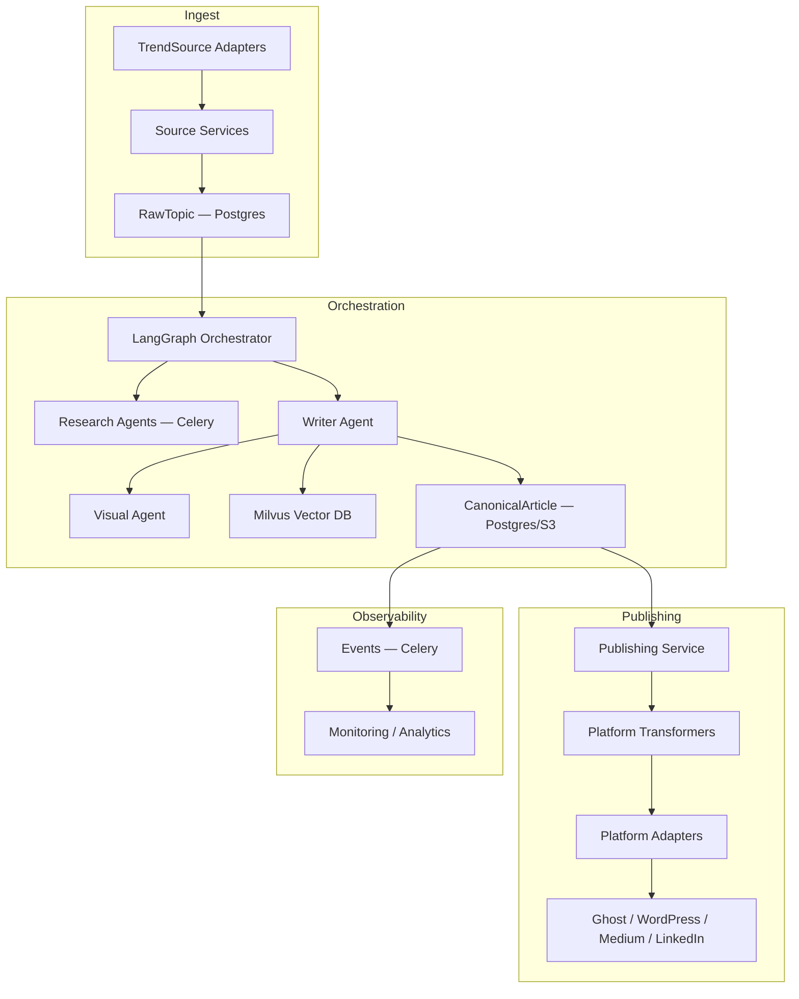

# Cognify Architecture Analysis: Modularity, Flexibility & Content-Platform Decoupling

> **Date**: 2026-03-15
> **Revision**: 2 (incorporates architectural corrections and AI discoverability analysis)
> **Purpose**: Architectural review of Cognify's modularity and flexibility for future integrations, with BizTalk Server separation-of-concerns patterns as a reference lens.
> **Scope**: Analysis only — no implementation changes.

---

## 1. Executive Summary

Cognify has a **solid foundation** with clean separation at the API, service, and client layers. However, as the system grows into content generation (Epic 3) and multi-platform publishing (Epic 5), the architecture needs a critical abstraction layer: **the decoupling of core content production from platform-specific content transformation and delivery**.

Drawing from BizTalk Server's architecture — where receive adapters, orchestrations, canonical messages, maps, and send adapters are independent — this report identifies where Cognify's patterns are strong, where they need reinforcement, and what the target architecture should look like.

Key findings:
- The inbound adapter pattern (trend sources) is strong and should be formalized with a protocol
- `CanonicalArticle` is the most important interface to define — it's the contract between content intelligence and content delivery
- LangGraph should remain the single orchestrator (no separate message bus or pipeline framework)
- Publishing needs a centralized service that delegates to transformer/adapter pairs per platform
- AI discoverability (structured data, `llms.txt`, AI crawler policies) is a gap that must be addressed alongside traditional SEO

---

## 2. What Exists Today: Strengths

### 2.1 Trend Source Adapter Pattern (Well Done)

Each trend source follows a consistent two-layer pattern:

```
Client (transport)          → Service (business logic)
hackernews_client.py           hackernews.py
google_trends_client.py        google_trends.py
reddit_client.py               reddit.py
newsapi_client.py              newsapi.py
arxiv_client.py                arxiv.py
```

**Client** handles HTTP/protocol concerns, error wrapping, raw response parsing.
**Service** handles domain filtering, scoring, normalization to `RawTopic`.

This is essentially a **Receive Adapter** pattern (BizTalk terminology). Each source ingests data from a different protocol/API and normalizes it into a canonical format (`RawTopic`). Adding a new trend source (e.g., Bluesky, Mastodon) requires zero changes to existing sources or the ranking pipeline.

**Verdict: Strong. This is the right pattern.**

### 2.2 Repository Protocol Pattern (Well Done)

`src/api/auth/repository.py` defines `RefreshTokenRepository` and `UserRepository` as Python `Protocol` classes. The `InMemoryRefreshTokenRepository` is a placeholder with the contract ready for PostgreSQL. This is textbook interface-based design.

**Verdict: Strong. Extend this pattern to all data access.**

### 2.3 Dependency Injection via FastAPI

Services are constructed per-request via factory functions (`_get_hn_service`, `_get_gt_service`, etc.) with test injection support via `app.state`. This keeps route handlers thin.

**Verdict: Adequate for current scale, but see Section 3.2.**

### 2.4 Canonical Data Model

`RawTopic` (Pydantic) serves as the **canonical message format** — the internal representation that all trend sources normalize to. This is analogous to BizTalk's canonical XML schema. The `TopicRankingService` operates solely on `RawTopic` objects, completely agnostic to where they came from.

This pattern exists in many successful modern architectures: Stripe event schemas, Kafka event schemas, Shopify internal commerce objects, Temporal workflow payload models.

**Verdict: Strong. This principle must extend to content generation.**

---

## 3. Structural Gaps & Risks for Future Epics

### 3.1 No Abstract Trend Source Interface

While each source *happens* to follow the same client+service pattern, there is **no formal contract** enforcing it. Each service has its own `fetch_and_normalize()` method, but there's no base class or protocol.

**Impact**: The `trends.py` router has 5 near-identical endpoint handlers with copy-pasted boilerplate (lines 83-276). Every new source adds ~40 lines of boilerplate. Without a protocol, you can't write generic code like "run all active sources in parallel" — each must be called individually.

**BizTalk comparison**: BizTalk receive adapters implement `IBTTransport` — a standard interface. The runtime discovers and orchestrates them uniformly.

### 3.2 Service Factory Boilerplate in Router

The pattern of `_get_*_service(request)` factory functions with `hasattr(request.app.state, "hn_client")` checks is repeated 5 times. This is a code smell — the router knows too much about service construction.

**Impact**: Every new integration duplicates this pattern. Test setup requires knowing exactly what to inject into `app.state`.

### 3.3 No Canonical Content Boundary (Critical for Epics 3-5)

The `src/pipelines/` directory exists but is empty. Epics 3-5 introduce:

```
Topic → Research → Draft → SEO → Visual → [Canonical Article] → Platform Transform → Publish
```

The critical missing piece is the boundary between **canonical article** and **platform-specific output**. Currently, there is no concept of:

1. A **canonical content format** (the article in its platform-agnostic form)
2. **Platform-specific transformers** (Markdown → Ghost HTML, → WordPress blocks, → Medium API payload, → LinkedIn post)

### 3.4 Content Generation Coupled to Publishing (The Core Problem)

The HIGH_LEVEL_ARCHITECTURE.md shows:

```
Writer Agent → Content Formatting Service → Publishing Service → Platform APIs
```

But the planned backlog reveals tight coupling:

- **CONTENT-003 (SEO Optimization)** is in the Content Generation epic, but SEO requirements differ per platform
- **PUBLISH-001-004** each describe platform-specific formatting *inside* the publishing service, mixing transport (API calls) with transformation (content formatting)
- There's no clear boundary where "the article is done" vs "now adapt it for Ghost/WordPress/Medium"

### 3.5 No AI Discoverability Strategy

The planned SEO work (CONTENT-003) targets traditional search engines only — meta titles, keyword density, Flesch-Kincaid readability. It doesn't address how AI agents (ChatGPT, Perplexity, Claude, Gemini) discover and cite content, which is the fastest-growing content discovery channel. See Section 7 for full analysis.

---

## 4. BizTalk Principles Applied to Cognify

### 4.1 What BizTalk Got Right

BizTalk's core insight: **separate message content from message transport, and separate business logic from both.**

| BizTalk Concept | Cognify Equivalent | Status |
|---|---|---|
| **Receive Adapter** | `*_client.py` (HN, Reddit, etc.) | Working well |
| **Receive Pipeline** | `*_service.py` (normalize → `RawTopic`) | Working, needs protocol |
| **Canonical Schema** | `RawTopic` (inbound), `CanonicalArticle` (outbound) | Inbound done, outbound needed |
| **Orchestration** | LangGraph StateGraph | Planned (Epic 2) |
| **Maps** | Platform Transformers | Not built yet |
| **Send Adapter** | Platform Adapters | Not built yet |

### 4.2 Where BizTalk Patterns Don't Apply

Three areas where BizTalk's ESB architecture would be over-engineering for Cognify:

**Message Box / Event Bus for orchestration**: BizTalk uses a Message Box (pub-sub broker) to route messages between components. Cognify already has LangGraph, which provides stateful orchestration with branching, checkpointing, and retries. Adding a separate message bus between the orchestrator and agents creates unnecessary indirection (`Orchestrator → Bus → Agent` when `Orchestrator → Agent` is sufficient). Events should be used only for system-level signals and observability, not intra-pipeline routing.

**Heavy pipeline framework**: BizTalk's pipeline abstraction exists because it processes millions of messages across dozens of protocols. Cognify's content workflow is already a pipeline — LangGraph edges define the flow, each node is a stage. Building a separate `src/pipelines/` framework on top would mean maintaining two orchestration layers. Instead, define Pydantic contracts at each LangGraph node boundary. `src/pipelines/` should hold reusable stage functions (pure business logic), not a framework that wraps LangGraph.

**Independent platform subscribers**: BizTalk's send ports subscribe independently to the Message Box. For Cognify, fragmenting publishing into independent Celery subscribers would duplicate cross-cutting concerns (retry logic, scheduling, credential management, rate limiting, analytics). A centralized Publishing Service that delegates to transformer/adapter pairs is the right pattern.

---

## 5. Target Architecture

### 5.1 Top-Level Diagram



### 5.2 Component Responsibilities

| Component | Responsibility | I/O |
|---|---|---|
| **TrendSource Adapter** (client) | HTTP/OAuth, rate-limits, retries. Returns raw payload. | Network → raw response |
| **Source Service** | Normalizes → `RawTopic`. Stores in Postgres. | Raw response → `RawTopic` |
| **LangGraph Orchestrator** | Plans research, spawns agents (via Celery), manages state, checkpointing, human gates. | `RawTopic` → `CanonicalArticle` |
| **Research Agents** | Parallel; index findings into Milvus; return structured summaries. | Research plan → findings |
| **Writer Agent** | Builds `CanonicalArticle` (Markdown + structured metadata + asset refs). Writes to DB + S3. | Findings → `CanonicalArticle` |
| **Publishing Service** | Single owner of scheduling, credentials, retries, rate-limits, analytics, publication state. | `CanonicalArticle` → publication records |
| **Platform Transformer** | Pure, synchronous function: `CanonicalArticle` → `PlatformPayload`. No I/O. Unit-testable. | `CanonicalArticle` → `PlatformPayload` |
| **Platform Adapter** | I/O: authentication, API calls, error mapping, DLQ. | `PlatformPayload` → external API |

### 5.3 Key Contracts / Interfaces

#### CanonicalArticle (the central contract)

```python
from pydantic import BaseModel
from datetime import datetime
from uuid import UUID

class SEOMetadata(BaseModel):
    title: str                    # 50-60 chars
    description: str              # 150-160 chars
    keywords: list[str]
    canonical_url: str | None

class Citation(BaseModel):
    title: str
    url: str
    authors: list[str] = []
    published_at: datetime | None

class ImageAsset(BaseModel):
    id: UUID
    url: str
    caption: str | None
    alt_text: str | None
    metadata: dict[str, str] = {}

class Provenance(BaseModel):
    research_session_id: UUID
    primary_model: str            # e.g., "claude-opus-4"
    drafting_model: str           # e.g., "claude-sonnet-4"
    embedding_model: str          # e.g., "all-MiniLM-L6-v2"
    embedding_version: str

class CanonicalArticle(BaseModel):
    id: UUID
    title: str
    subtitle: str | None
    body_markdown: str
    summary: str                  # 1-2 sentence extractive summary
    key_claims: list[str]         # Top 3-5 factual claims with citation refs
    content_type: str             # "article", "how-to", "analysis", "report"
    seo: SEOMetadata
    citations: list[Citation]
    visuals: list[ImageAsset]
    authors: list[str]
    domain: str
    generated_at: datetime
    provenance: Provenance
    ai_generated: bool = True     # AI disclosure flag
```

This is the **single contract** between content generation and publishing.

#### TrendSource Protocol

```python
class TrendSource(Protocol):
    source_name: str
    async def fetch_and_normalize(self, cfg: TrendFetchConfig) -> list[RawTopic]: ...
```

#### Transformer Protocol

```python
class Transformer(Protocol):
    def transform(self, article: CanonicalArticle) -> PlatformPayload: ...
```

#### Adapter Protocol

```python
class Adapter(Protocol):
    async def publish(
        self, payload: PlatformPayload, schedule_at: datetime | None
    ) -> PublicationResult: ...
```

### 5.4 Event Model

Events are for **observability and optional async subscribers**, not for orchestrator sequencing. LangGraph controls the main flow.

| Event | Payload | Purpose |
|---|---|---|
| `topic.discovered` | RawTopic id, domain, score | Analytics, dashboard updates |
| `research.started` | research_session_id | Progress tracking |
| `research.completed` | research_session_id, findings_count | Progress tracking |
| `article.generated` | canonical_article_id | Triggers publishing, analytics |
| `publication.attempted` | publication_id, platform | Monitoring |
| `publication.succeeded` | publication_id, platform, external_url | Dashboard updates, `llms.txt` regeneration |
| `publication.failed` | publication_id, platform, error | Alerting, DLQ |

Start with Celery events + Redis broker (already in the stack). Migrate to Kafka/EventBridge only if event throughput or multi-consumer needs grow.

### 5.5 Publishing Service Architecture

```
PublishingService (cross-cutting: retry, schedule, credentials, tracking)
       |
       ├── GhostTransformer    → GhostAdapter    → Ghost Admin API
       ├── WordPressTransformer → WordPressAdapter → WP REST API
       ├── MediumTransformer   → MediumAdapter    → Medium API
       └── LinkedInTransformer → LinkedInAdapter  → LinkedIn Marketing API
```

**Why centralized, not fragmented**: Publishing platforms share cross-cutting concerns — credential rotation, schedule maintenance, retry/backoff strategies, rate-limits, publication analytics, and platform-level error semantics. Distributing that logic into independent subscribers duplicates complexity and risks inconsistent behavior.

Adding a new platform (e.g., Substack) means:
1. Create `SubstackTransformer` (pure function)
2. Create `SubstackAdapter` (API transport)
3. Register in PublishingService
4. Zero changes to orchestrator, content engine, or existing platform modules

---

## 6. Risk Assessment

| Risk | Current State | If Not Addressed |
|---|---|---|
| Platform logic leaks into content engine | No content engine yet — preventable | Each new platform adds complexity to the content pipeline; modifying one platform risks breaking another |
| Trend source boilerplate explosion | 5 sources with copy-pasted handlers | 10 sources = 400+ lines of duplicated router code |
| No canonical article format | Not yet needed | Writer Agent output format becomes the de facto contract; changing it later requires rewriting all platform adapters |
| Duplicated cross-cutting concerns | Not built yet | Independent platform subscribers duplicate retry, scheduling, credential, and analytics logic |
| Content invisible to AI agents | No AI discoverability strategy | Published content is not cited by ChatGPT, Perplexity, or Claude — the fastest-growing discovery channel |

---

## 7. AI Discoverability: The Missing Layer

### 7.1 The Problem

The SEO work planned in CONTENT-003 targets traditional search engines (Google circa 2020 — meta titles, keyword density, readability scores). It does not address how AI agents discover, parse, and cite content.

| Traditional Search Engine | AI Agent (ChatGPT, Perplexity, Claude) |
|---|---|
| Indexes keywords, backlinks, meta tags | Parses structure, extracts factual claims, evaluates citation quality |
| Ranks by PageRank + relevance signals | Retrieves via RAG — prefers concise, well-structured, citable passages |
| Reads HTML + meta tags | Reads structured data (JSON-LD), semantic HTML, `llms.txt`, RSS/Atom |
| Respects `robots.txt` | Has its own user-agents: `GPTBot`, `PerplexityBot`, `ClaudeBot`, `Google-Extended` |
| Follows sitemaps | Also follows sitemaps, plus API access and feeds |

Cognify generates content that **should** be cited by these agents. If it's not structured for AI consumption, it's invisible to the fastest-growing discovery channel.

### 7.2 What's Missing

**1. No Structured Data Strategy**

AI agents (and Google's AI Overviews) rely on **Schema.org JSON-LD** markup. Each published article should include:

```json
{
  "@context": "https://schema.org",
  "@type": "Article",
  "headline": "...",
  "author": { "@type": "Organization", "name": "..." },
  "datePublished": "2026-03-15",
  "dateModified": "2026-03-15",
  "citation": [
    { "@type": "CreativeWork", "url": "...", "name": "..." }
  ]
}
```

This is **platform-specific output** — Ghost renders JSON-LD differently than WordPress. This fits into the **Transformer** layer: `CanonicalArticle` carries the structured data, each `PlatformTransformer` renders it for the target platform's markup conventions.

**2. No `llms.txt` Support**

`llms.txt` is an emerging standard (proposed by Jeremy Howard / Answer.AI). It's a file at the site root — like `robots.txt` but for LLMs — that provides a structured, machine-readable summary of site content:

```
# Cognify Blog
> AI-generated research articles on cybersecurity, AI/ML, and cloud computing.

## Articles
- [Title](url): One-line summary
- [Title](url): One-line summary

## How to cite
Author: Cognify Research
Format: "Title" by Cognify Research, published [date], [url]
```

This should be auto-generated and updated by the Publishing Service whenever a new article goes live (triggered by `publication.succeeded` event).

**3. No AI Crawler Access Policy**

The security checklist mentions `robots.txt` only for respecting *other* sites' policies when scraping. There's no policy for Cognify's own published content. Many publishing platforms block AI crawlers by default. Cognify should explicitly **allow**:

```
User-agent: GPTBot
Allow: /

User-agent: PerplexityBot
Allow: /

User-agent: ClaudeBot
Allow: /

User-agent: Google-Extended
Allow: /
```

This is a platform adapter concern — each platform handles `robots.txt` differently.

**4. No Citation-Optimized Content Structure**

Perplexity and ChatGPT cite sources. The likelihood of being cited increases when:

- Articles have **clear, self-contained sections** with direct answers near the top
- **Factual claims are inline-cited** (Cognify already plans this in CONTENT-004)
- **Headings are question-shaped** where appropriate ("What is X?" not just "X") — AI agents match these to user queries
- **Author and date are machine-readable**, not just visually displayed

The Writer Agent's prompt engineering should account for this.

**5. No Content Provenance**

The EU AI Act and various platforms require **AI content disclosure**. The security checklist mentions it but has no implementation strategy. The `CanonicalArticle` includes `ai_generated: bool` and a `Provenance` model, but this must flow through to published output as visible metadata and machine-readable signals.

### 7.3 How This Fits the Architecture

The transformer/adapter pattern handles all of this cleanly:

```
CanonicalArticle (has: title, citations, authors, seo, summary, key_claims, provenance)
       |
PlatformTransformer
  ├── Renders JSON-LD structured data (Schema.org Article)
  ├── Generates platform-specific meta tags (OG, Twitter Cards)
  ├── Formats semantic HTML (article, section, header elements)
  ├── Includes AI disclosure per platform requirements
  └── Returns PlatformPayload

PublishingService (cross-cutting, post-publish)
  ├── Updates llms.txt after each publication (triggered by publication.succeeded)
  ├── Manages robots.txt AI crawler policy per platform
  └── Regenerates sitemap with lastmod dates
```

### 7.4 Additions to CanonicalArticle for AI Discoverability

These fields are already included in the schema in Section 5.3:

- `summary: str` — 1-2 sentence extractive summary for `llms.txt`, OG descriptions, AI snippets
- `key_claims: list[str]` — Top 3-5 factual claims with citation refs, aids RAG extraction
- `content_type: str` — Maps to Schema.org `@type` for structured data
- `ai_generated: bool` — Drives disclosure rendering per platform

### 7.5 Impact on Existing Backlog

This is not a separate epic — it threads through existing tickets:

| Ticket | Change Needed |
|---|---|
| **CONTENT-003** (SEO Optimization) | Expand to "SEO & AI Discoverability" — add structured data generation, citation-optimized structure, `llms.txt` summary generation |
| **PUBLISH-001-004** (Platform integrations) | Each platform transformer must output JSON-LD, manage `robots.txt` AI crawler policy, render AI disclosure |
| **Publishing Service** | Add `llms.txt` auto-generation and sitemap management as post-publish hooks |
| **Writer Agent** (CONTENT-001/002) | Prompt engineering for citation-optimized structure: question-shaped headings, self-contained sections, direct answers early |

---

## 8. Summary Matrix

| Architectural Concern | Current Grade | Notes |
|---|---|---|
| **Inbound source abstraction** | **B+** | Pattern is right but lacks formal protocol/interface |
| **Canonical inbound model** | **A** | `RawTopic` is clean, well-defined |
| **Service layer isolation** | **A-** | Clean separation, Protocol-based repos |
| **API layer design** | **A** | Middleware chain, error handling, auth/RBAC solid |
| **Content engine decoupling** | **N/A** | Not built yet — design-time opportunity |
| **Platform transformation layer** | **N/A** | Not built yet — must be separate from content engine |
| **Publishing adapter pattern** | **N/A** | Not built yet — centralized service with transformer/adapter pairs |
| **LangGraph as orchestrator** | **N/A** | Planned — should be the single orchestrator, no separate pipeline framework |
| **AI discoverability** | **D** | Not addressed; CONTENT-003 covers only traditional SEO |
| **Configuration extensibility** | **B** | Pydantic Settings works; per-domain config not yet modeled |

---

## 9. Migration Plan (Incremental, Low-Risk)

| Step | Action | Risk |
|---|---|---|
| 1 | Define `CanonicalArticle` model, add to codebase. Writer Agent emits `CanonicalArticle` to DB + S3. | Low — new code, no existing dependencies |
| 2 | Create `Transformer` + `Adapter` protocols and one Ghost transformer + adapter. Route `article.generated` → `PublishingService.publish(ghost)`. | Low — single platform, validates pattern |
| 3 | Formalize `TrendSource` protocol, register current sources behind a registry. Replace copy-paste router factories with registry-driven executor. | Medium — refactors existing code |
| 4 | Move all platform-specific logic into `services/publishing/<platform>/transformer.py` + `adapter.py`. Keep Publishing Service as the orchestrator of publish flows. | Low — new code per platform |
| 5 | Add event emission for `article.generated`, `publication.succeeded`. Start consumers for analytics, `llms.txt` regeneration, and monitoring. | Low — additive |
| 6 | Expand CONTENT-003 to include structured data (JSON-LD), `llms.txt` generation, AI crawler policies. | Low — additive |

---

## 10. Practical Fixes to Apply Now

These are small, high-impact changes that don't require waiting for future epics:

1. **Add `TrendSource` protocol** and replace repeated router factories — removes boilerplate
2. **Use `src/pipelines/` for reusable stage functions** (pure business logic), not a framework — let LangGraph coordinate order
3. **Move platform-specific formatting** into `services/publishing/<platform>/transformer.py` and transport into `adapter.py` (pure functions vs I/O) when publishing is built
4. **Record model versions and embedding versions** inside `Provenance` of `CanonicalArticle` for reproducibility

---

## 11. Key Takeaway

The most important decision ahead is establishing the **canonical article boundary**. Everything upstream (research, drafting, SEO defaults) produces a canonical article. Everything downstream (Ghost formatting, WordPress blocks, Medium markdown, LinkedIn excerpt, JSON-LD structured data, AI disclosure) consumes it. These two worlds should never share code beyond the canonical schema itself.

The `CanonicalArticle` Pydantic model is the system's most important interface — the contract between "content intelligence" and "content delivery."

LangGraph is the orchestrator. The Publishing Service owns cross-cutting publishing concerns. Platform Transformers are pure functions. Platform Adapters handle transport. Events are for observability. And AI discoverability is a first-class concern baked into the transformer layer, not an afterthought bolted on later.

---

## Appendix A: DASH-001 Compatibility Check

The DASH-001 dashboard spec (2026-03-15) was reviewed against these recommendations. **No conflicts found**:

- Frontend consumes a single backend endpoint (`GET /api/v1/dashboard/topics`), not individual source adapters — respects separation of concerns
- Mock-first approach with typed hooks means the frontend depends on canonical data shapes, not implementation details
- No publishing or content transformation logic in the frontend
- Component structure (`MetricCard`, `TopicRow`, `ArticleRow`) maps 1:1 to backend Pydantic models
- Minor note: the `domain` field added to `RankedTopic` on the frontend should be added to the backend schema when the real endpoint is built

## Appendix B: Future Enhancement — Knowledge Graph

For a later phase, combining Milvus (semantic similarity) with a Knowledge Graph (Neo4j/JanusGraph) would enable:

- **Topic clustering**: Grouping articles covering the same event from different angles
- **Citation lineage**: Tracking which sources are cited most, and by which articles
- **Cross-article linking**: Automatic "Related Articles" based on explicit relationships, not just vector similarity
- **Content gap detection**: Identifying subtopics with no coverage
- **Concept evolution tracking**: How topics develop over time

Research Agents would upsert entities/relations into the graph alongside Milvus embeddings. The Writer Agent would query the graph for internal links and concept connections. This is deferred until the content pipeline is producing articles at scale (50+ articles) and relationship patterns become observable.
