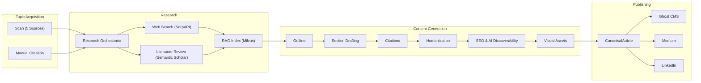
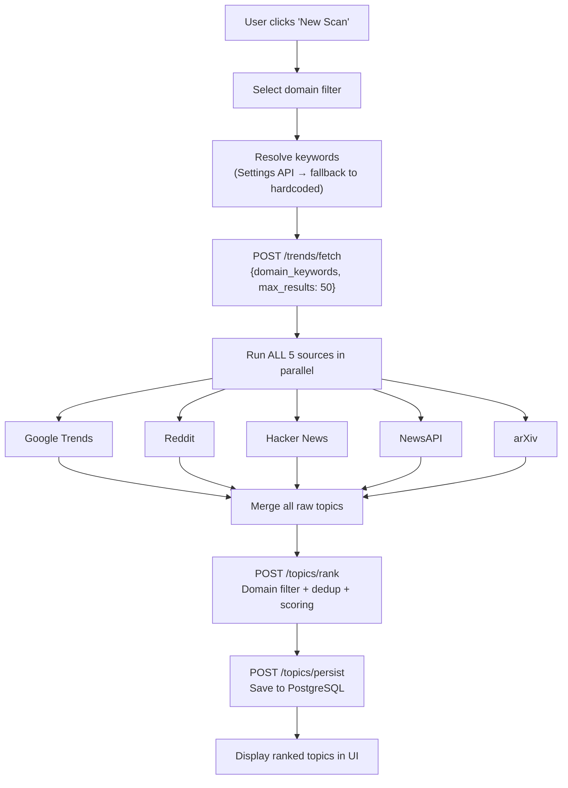
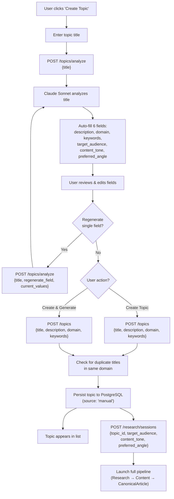
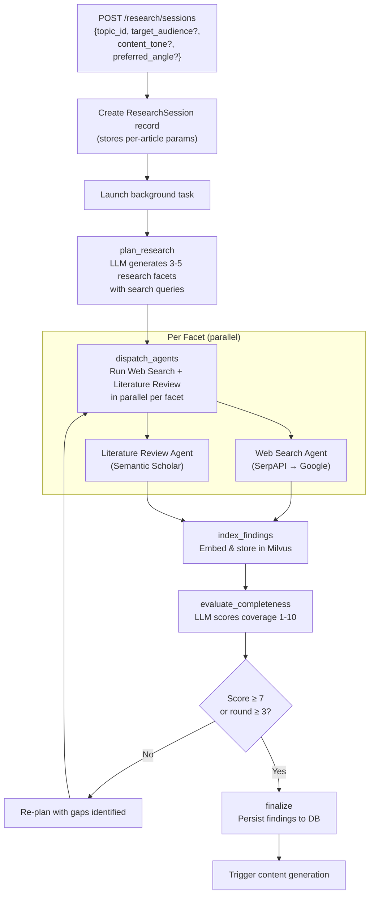
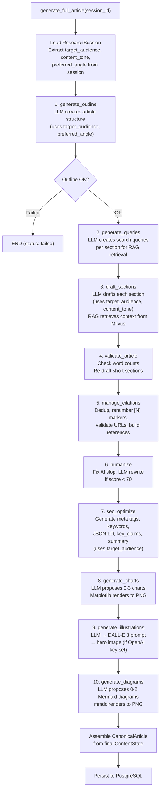
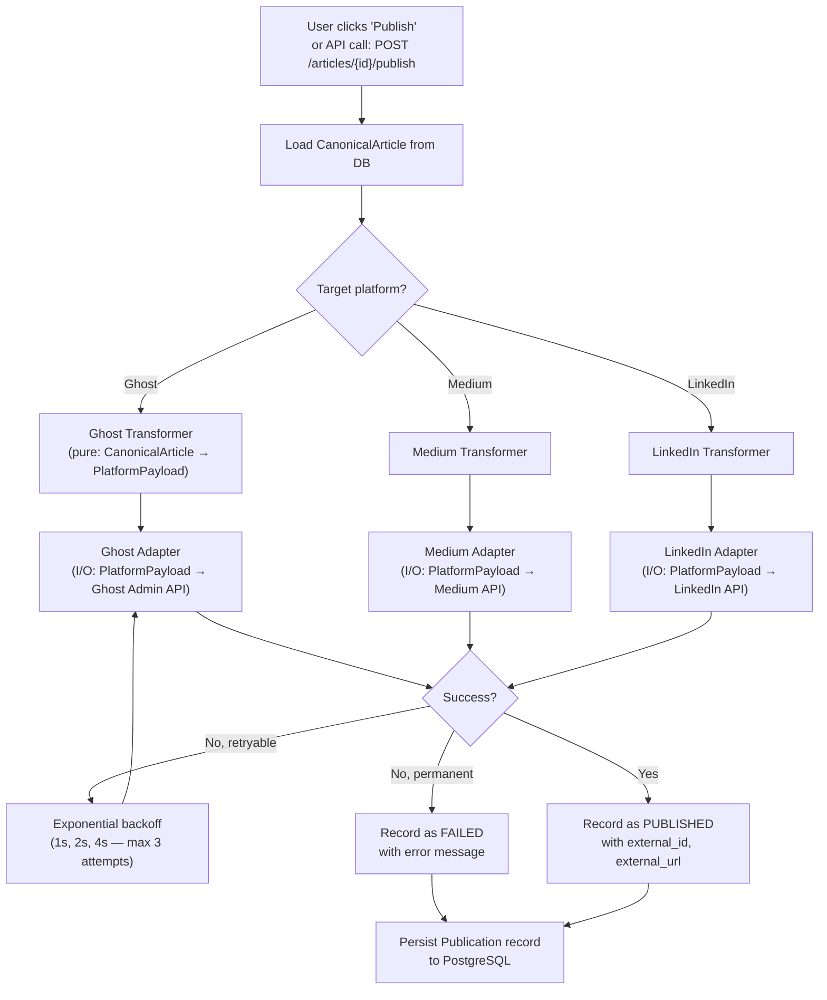
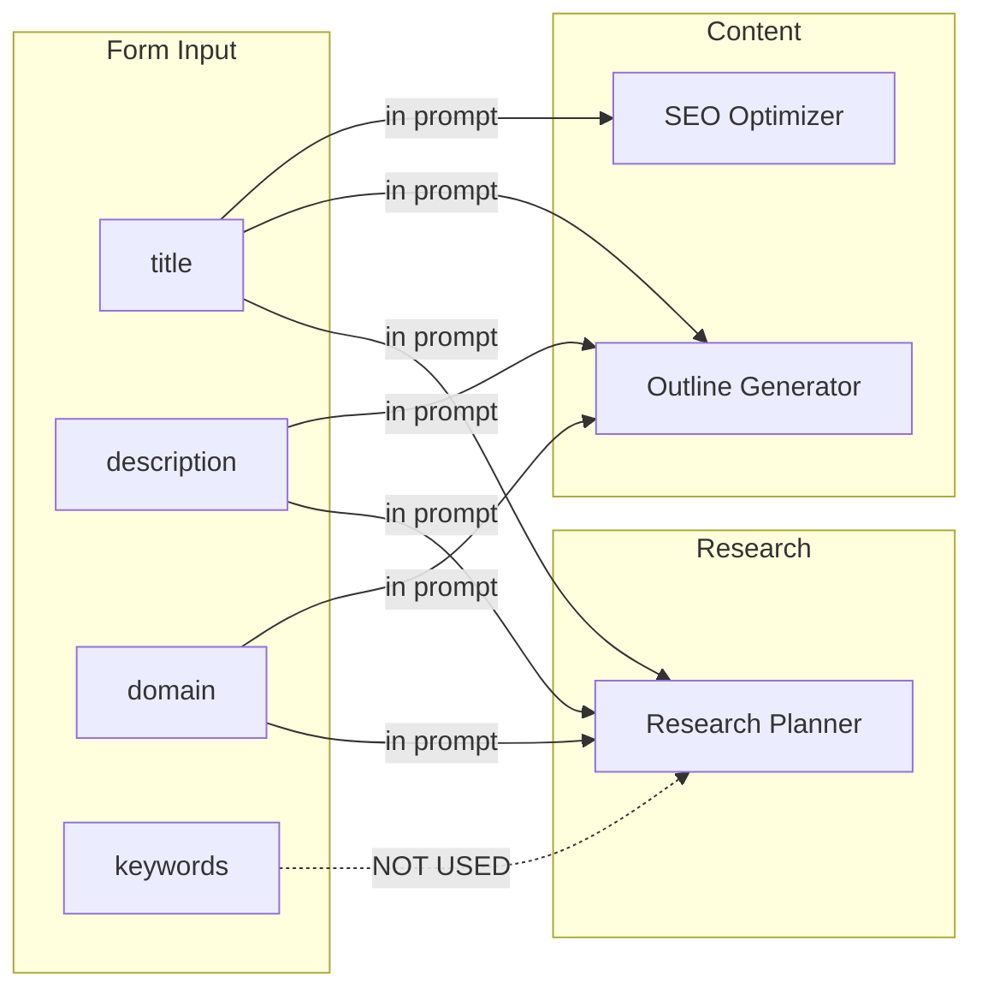
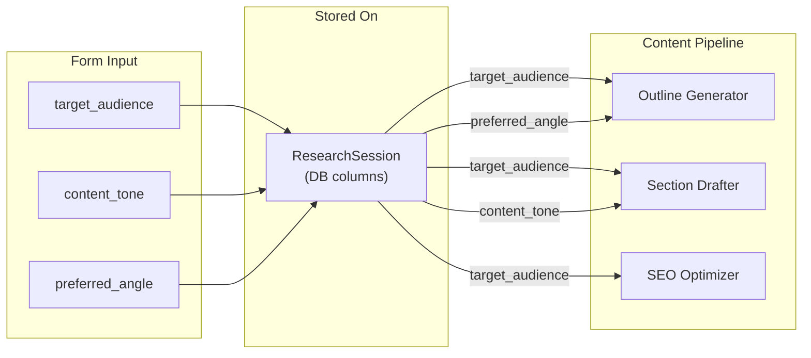

# End-to-End Flow: Topic Discovery to Publication

> **Purpose**: Comprehensive walkthrough of every stage in Cognify's pipeline — from discovering or creating a topic, through multi-agent research, content generation, and multi-platform publishing. Includes Mermaid flowcharts and parameter flow tables for each phase.

---

## Table of Contents

1. [High-Level Overview](#1-high-level-overview)
2. [Phase 1: Topic Discovery (Scan Flow)](#2-phase-1-topic-discovery-scan-flow)
3. [Phase 2: Manual Topic Creation](#3-phase-2-manual-topic-creation)
4. [Phase 3: Research Pipeline](#4-phase-3-research-pipeline)
5. [Phase 4: Content Generation Pipeline](#5-phase-4-content-generation-pipeline)
6. [Phase 5: Publishing](#6-phase-5-publishing)
7. [Parameter Flow Summary](#7-parameter-flow-summary)
8. [External API Reference](#8-external-api-reference)
9. [Known Gaps and Notes](#9-known-gaps-and-notes)

---

## 1. High-Level Overview



**Two entry points** produce a persisted `Topic`. The user then triggers article generation, which launches the research pipeline, content generation, and optionally publishing.

---

## 2. Phase 1: Topic Discovery (Scan Flow)

### 2.1 Flowchart



### 2.2 Domain Keywords

Keywords drive what each source searches for (or filters by). They come from two sources:

1. **Settings API** (priority): User-configured domains in Settings > Domains tab, stored in the database
2. **Hardcoded fallback** (`frontend/src/types/domain.ts`):
   - `cybersecurity`: cybersecurity, security, infosec, threat, vulnerability
   - `ai-ml`: artificial intelligence, machine learning, deep learning, AI, ML
   - `cloud`: cloud computing, AWS, Azure, GCP, kubernetes
   - `devops`: devops, CI/CD, infrastructure, deployment, SRE

### 2.3 How Each Source Uses Keywords

| Source | External API | API Key Setting | Uses Keywords in API Query? | What It Fetches | Post-Fetch Filtering |
|--------|-------------|-----------------|---------------------------|-----------------|---------------------|
| **Google Trends** | pytrends (unofficial scraper) | None (no key needed) | **Yes** — `related_queries(keywords[:5])` | US trending searches + related queries for domain keywords | Keyword substring match in title |
| **Reddit** | asyncpraw (OAuth2) | `COGNIFY_REDDIT_CLIENT_ID` + `COGNIFY_REDDIT_CLIENT_SECRET` | **No** — fetches from hardcoded subreddits | "Hot" posts (today) from configured subreddits | Keyword match in title, selftext, subreddit name |
| **Hacker News** | Algolia HN Search (public) | None (public API) | **Yes** — all keywords joined as search query | Stories matching keywords with >10 points | Keyword match in title or URL |
| **NewsAPI** | newsapi.org `/v2/top-headlines` | `COGNIFY_NEWSAPI_API_KEY` | **No** — fetches category `"technology"`, country `"us"` | Latest top tech headlines | Keyword match in title, description, source, content |
| **arXiv** | arXiv API (public) | None (public API) | **No** — searches by CS category codes (`cs.CR`, `cs.AI`, `cs.LG`) | Recent papers sorted by submission date | Keyword match in title, abstract, categories |

**Key insight**: Only Google Trends and Hacker News pass keywords to their external APIs. Reddit, NewsAPI, and arXiv fetch broad content and filter locally by keyword matching.

### 2.4 Source Configuration

| Setting | Default | Affects |
|---------|---------|---------|
| `COGNIFY_GT_DEFAULT_COUNTRY` | `united_states` | Google Trends country |
| `COGNIFY_GT_LANGUAGE` | `en-US` | Google Trends language |
| `COGNIFY_REDDIT_DEFAULT_SUBREDDITS` | `["cybersecurity", "programming", "netsec", "technology"]` | Reddit subreddits |
| `COGNIFY_REDDIT_SCORE_CAP` | `1000` | Reddit normalization cap |
| `COGNIFY_HN_DEFAULT_MIN_POINTS` | `10` | Hacker News minimum story points |
| `COGNIFY_NEWSAPI_DEFAULT_CATEGORY` | `technology` | NewsAPI headline category |
| `COGNIFY_NEWSAPI_DEFAULT_COUNTRY` | `us` | NewsAPI country filter |
| `COGNIFY_ARXIV_DEFAULT_CATEGORIES` | `["cs.CR", "cs.AI", "cs.LG"]` | arXiv paper categories |

### 2.5 Topic Ranking

After all sources return raw topics, ranking applies four weighted factors:

| Factor | Weight | How It Works |
|--------|--------|-------------|
| **Relevance** | 40% | Jaccard similarity between topic tokens and domain keyword tokens |
| **Recency** | 30% | Exponential decay with 24h half-life from `discovered_at` |
| **Velocity** | 20% | Min-max normalized across all topics |
| **Diversity** | 10% | Based on source count (1 source → 33, 2 → 66, 3+ → 100) |

Before scoring, deduplication groups topics with cosine similarity ≥ 0.85 (using `all-MiniLM-L6-v2` embeddings), keeping the highest-scored topic per group.

---

## 3. Phase 2: Manual Topic Creation

### 3.1 Flowchart



### 3.2 Form Fields and Where They Go

| Field | Source | Stored On | Flows To |
|-------|--------|-----------|----------|
| `title` | User-entered | Topic (DB) | Research planning, outline generation, SEO |
| `description` | LLM-suggested, editable | Topic (DB) | Research planning, outline generation |
| `domain` | LLM-suggested, editable | Topic (DB) | Research planning, outline context |
| `keywords` | LLM-suggested, editable | Topic (DB) | **Not used downstream** (see [Known Gaps](#9-known-gaps-and-notes)) |
| `target_audience` | LLM-suggested, editable | ResearchSession (DB) | Outline generation, section drafting, SEO |
| `content_tone` | LLM-suggested, dropdown | ResearchSession (DB) | Section drafting only |
| `preferred_angle` | LLM-suggested, editable | ResearchSession (DB) | Outline generation only |

### 3.3 Topic Analysis (LLM Auto-Fill)

The `TopicAnalyzer` service (`src/services/topic_analyzer.py`) sends the title to Claude Sonnet with a structured JSON prompt. If the user configured domains in Settings, these are included so the LLM can select from them.

**Content tone options**: `technical-authoritative`, `conversational`, `educational`, `analytical`, `news-reporting`

**Regeneration**: When the user clicks the regenerate icon on a single field, only that field is re-generated. The current values of all other fields are sent to the LLM so it maintains consistency.

### 3.4 "Create Topic" vs "Create & Generate Article"

- **Create Topic**: Saves `{title, description, domain, keywords}` to the topic table. The `target_audience`, `content_tone`, and `preferred_angle` fields are **discarded** — they are not stored on the topic entity.
- **Create & Generate Article**: Creates the topic, then immediately creates a research session with `{target_audience, content_tone, preferred_angle}` and launches the full pipeline.

### 3.5 Generate Article Modal (for Scan-Discovered Topics)

For topics discovered via scanning, the **GenerateArticleModal** provides an optional "Customize Article" collapsible section with the same three per-article params:

- `target_audience` (free text)
- `content_tone` (dropdown)
- `preferred_angle` (free text)

If the user doesn't expand this section, no per-article params are sent and the pipeline uses defaults.

---

## 4. Phase 3: Research Pipeline

### 4.1 Flowchart



### 4.2 Research Planning

The LLM receives `{title, description, domain}` from the `TopicInput` model and generates a `ResearchPlan` with 3-5 `ResearchFacet` objects. Each facet contains:

- `title`: Facet name (e.g., "Recent zero-day incidents")
- `description`: What to investigate
- `search_queries`: List of 2-3 search query strings
- `source_type`: `web`, `academic`, or `both`

**Parameters used in planning prompt**:

| Parameter | Used? | How |
|-----------|-------|-----|
| `title` | Yes | Included in planning prompt |
| `description` | Yes | Included in planning prompt |
| `domain` | Yes | Included in planning prompt |
| `keywords` | **No** | Not in `TopicInput` model |
| `target_audience` | **No** | Not passed to orchestrator |
| `content_tone` | **No** | Not passed to orchestrator |
| `preferred_angle` | **No** | Not passed to orchestrator |

### 4.3 Web Search Agent

For each facet with `source_type` in `["web", "both"]`:

1. Runs all `search_queries` in parallel via `SerpAPIClient`
2. Each query → `GET https://serpapi.com/search` with `{q: query, engine: "google", num: 10}`
3. Extracts `organic_results` (title, link, snippet, position, date)
4. Deduplicates by URL across queries
5. LLM extracts claims and summaries from snippets

**SerpAPI parameters**:

| Parameter | Value | Notes |
|-----------|-------|-------|
| `q` | LLM-generated query string | Not the user's keywords directly |
| `engine` | `google` | Always Google search |
| `num` | 10 (default) | Results per query |
| `api_key` | `COGNIFY_SERPAPI_API_KEY` | Required |
| Date filter | **None** | No `tbs` parameter — returns all-time results |
| Location | **None** | No geographic filtering |

### 4.4 Literature Review Agent

For each facet with `source_type` in `["academic", "both"]`:

1. Runs `search_queries` via `SemanticScholarClient`
2. Each query → `GET https://api.semanticscholar.org/graph/v1/paper/search`
3. Returns papers with title, abstract, authors, year, citation count
4. LLM extracts claims and summaries from abstracts

**Semantic Scholar parameters**:

| Parameter | Value |
|-----------|-------|
| `query` | LLM-generated query string |
| `limit` | 5 per query (configurable: `COGNIFY_SEMANTIC_SCHOLAR_RESULTS_PER_QUERY`) |
| `fields` | paperId, title, abstract, authors, year, citationCount, venue, url |
| `x-api-key` | `COGNIFY_SEMANTIC_SCHOLAR_API_KEY` (optional) |

### 4.5 RAG Indexing (Milvus)

After search agents return `SourceDocument` objects:

1. Documents are chunked via `TokenChunker` (configurable chunk size)
2. Chunks are embedded using `all-MiniLM-L6-v2` sentence transformer
3. Embeddings are stored in Milvus vector database
4. Later, during content generation, the `MilvusRetriever` performs similarity search to provide relevant context for section drafting

### 4.6 Completeness Evaluation

The LLM scores research completeness on a 1-10 scale. If score < 7 and round < 3, the orchestrator identifies coverage gaps and generates new facets/queries for another round.

---

## 5. Phase 4: Content Generation Pipeline

### 5.1 Flowchart



### 5.2 Pipeline Nodes — Detail

| # | Node | Purpose | LLM Calls | External APIs | Per-Article Params Used |
|---|------|---------|-----------|---------------|------------------------|
| 1 | **generate_outline** | Create article structure (sections, word targets) | 1 | None | `target_audience`, `preferred_angle` |
| 2 | **generate_queries** | Create RAG search queries per section | 1 | None | None |
| 3 | **draft_sections** | Write each section with RAG context | 1 per section | Milvus (similarity search) | `target_audience`, `content_tone` |
| 4 | **validate_article** | Check word counts, re-draft short sections | 0-1 (if re-draft needed) | Milvus | `target_audience`, `content_tone` |
| 5 | **manage_citations** | Dedup citations, renumber markers, validate URLs | 0 | HTTP HEAD (URL checks) | None |
| 6 | **humanize** | Remove AI patterns, LLM rewrite low-scoring text | 0-N (per low-scoring section) | None | None |
| 7 | **seo_optimize** | Generate SEO metadata, key claims, JSON-LD | 2 | None | `target_audience` |
| 8 | **generate_charts** | Propose and render data charts | 1 | None (Matplotlib local) | None |
| 9 | **generate_illustrations** | Generate hero image via DALL-E 3 | 1 (prompt) | OpenAI DALL-E 3 API | None |
| 10 | **generate_diagrams** | Propose and render Mermaid diagrams | 1 | None (mmdc CLI local) | None |

### 5.3 How Per-Article Params Affect Prompts

**Outline Generation** (`src/agents/content/outline_generator.py`):
```
Target audience: {target_audience}     ← injected if provided
Editorial angle: {preferred_angle}     ← injected if provided
```
These lines are added before the "Requirements:" section in the prompt.

**Section Drafting** (`src/agents/content/section_drafter.py`):
```
Write for this audience: {target_audience}.    ← appended to system prompt
Tone: {content_tone}.                          ← appended to system prompt
```

**SEO Optimization** (`src/agents/content/seo_optimizer.py`):
```
Target audience: {target_audience}. Optimize keywords for what this audience searches.
```
Appended to the SEO metadata generation prompt.

### 5.4 CanonicalArticle Assembly

The final `ContentState` is assembled into a `CanonicalArticle` — the platform-neutral boundary contract (see [ADR-003](adrs/ADR-003-canonical-article-boundary.md)):

| CanonicalArticle Field | Source |
|----------------------|--------|
| `title` | From outline |
| `subtitle` | From outline |
| `body_markdown` | Joined section drafts with renumbered citations |
| `summary` | From SEO/AI discoverability node |
| `key_claims` | From SEO/AI discoverability node |
| `content_type` | From outline (article/how-to/analysis/report) |
| `seo` | SEO metadata (title, description, keywords, canonical_url, JSON-LD) |
| `citations` | Global citation list (deduplicated, with URLs validated) |
| `visuals` | Charts + hero image + diagrams (list of `ImageAsset`) |
| `authors` | `["Cognify"]` |
| `domain` | From topic |
| `provenance` | Models used (primary, drafting, embedding) + session ID |
| `ai_generated` | `True` |

---

## 6. Phase 5: Publishing

### 6.1 Flowchart



### 6.2 Transformer/Adapter Pattern

Each platform has two components (see [ADR-004](adrs/ADR-004-publishing-transformer-adapter-pattern.md)):

- **Transformer** (pure, no I/O): Converts `CanonicalArticle` → `PlatformPayload`
- **Adapter** (I/O): Sends `PlatformPayload` → external platform API

### 6.3 Platform-Specific Transformations

#### Ghost CMS

| Aspect | Details |
|--------|---------|
| **Content format** | HTML wrapped in Lexical HTML card (Ghost 5+ requirement — see L-009) |
| **Markdown → HTML** | Python `markdown` library with code highlighting |
| **Citations** | `[N]` markers converted to clickable `<a>` anchor links |
| **Visuals** | Charts/diagrams injected as `<figure>` elements after their source sections |
| **References** | Stripped from markdown, rebuilt as clean `<ol>` HTML list |
| **SEO** | JSON-LD `<script>` tag prepended to body |
| **Metadata** | title, slug, custom_excerpt, meta_title, meta_description, canonical_url, tags, feature_image |
| **Auth** | Admin API Key + JWT (HS256) |

#### Medium

| Aspect | Details |
|--------|---------|
| **Content format** | Raw HTML from markdown conversion |
| **Citations** | Not linkified (plain markdown conversion) |
| **Visuals** | Not injected (not supported by Medium API) |
| **Metadata** | title, contentFormat: "html", up to 5 tags, canonicalUrl |
| **Auth** | Integration Token |

#### LinkedIn

| Aspect | Details |
|--------|---------|
| **Content format** | Plain text commentary (max 3000 chars) — NOT the full article |
| **Content source** | `key_claims` from CanonicalArticle (not `body_markdown`) |
| **Structure** | First claim as hook → remaining claims as `→ takeaways` → hashtags |
| **Fallback** | If no `key_claims`, uses `summary` (stripped of "The article discusses..." framing) |
| **Hashtags** | Up to 5 from SEO keywords, alphanumeric only |
| **Metadata** | title, description (256 char), source_url, visibility: PUBLIC |
| **Auth** | OAuth2 access token |
| **API version** | `202603` (LinkedIn REST API versioning) |

### 6.4 Publishing Service Features

- **Retry**: Up to 3 attempts with exponential backoff (1s, 2s, 4s) for transient failures
- **Scheduling**: `schedule_at` parameter for future publishing (LinkedIn does not support this)
- **Publication tracking**: Each publish creates/updates a `Publication` record with event history
- **Retry failed**: `retry(publication_id)` re-publishes failed publications

---

## 7. Parameter Flow Summary

### 7.1 Topic Fields



### 7.2 Per-Article Params



### 7.3 Complete Matrix

| Field | Stored On | Research Planning | Search Queries | Outline | Section Drafting | SEO | Publishing |
|-------|-----------|-------------------|----------------|---------|-----------------|-----|-----------|
| `title` | Topic | Yes | Indirect (LLM generates from it) | Yes | No | Yes | Yes (metadata) |
| `description` | Topic | Yes | Indirect | Yes | No | No | Yes (metadata) |
| `domain` | Topic | Yes | Indirect | Yes | No | No | Yes (tags) |
| `keywords` | Topic | **Not used** | **Not used** | **Not used** | **Not used** | **Not used** | **Not used** |
| `target_audience` | ResearchSession | No | No | Yes | Yes | Yes | No |
| `content_tone` | ResearchSession | No | No | No | Yes | No | No |
| `preferred_angle` | ResearchSession | No | No | Yes | No | No | No |

---

## 8. External API Reference

| API | Purpose | Key Setting | Used In Phase |
|-----|---------|-------------|---------------|
| **pytrends** (Google Trends) | Trending search discovery | None (scraper) | Topic Discovery |
| **Reddit (PRAW)** | Hot post discovery | `COGNIFY_REDDIT_CLIENT_ID` + `_SECRET` | Topic Discovery |
| **Algolia HN Search** | Hacker News story search | None (public) | Topic Discovery |
| **newsapi.org** | Top headlines | `COGNIFY_NEWSAPI_API_KEY` | Topic Discovery |
| **arXiv API** | Academic paper feeds | None (public) | Topic Discovery |
| **Claude (Anthropic)** | LLM inference (planning, drafting, SEO, analysis) | `COGNIFY_ANTHROPIC_API_KEY` | All phases |
| **SerpAPI** | Google web search for research | `COGNIFY_SERPAPI_API_KEY` | Research |
| **Semantic Scholar** | Academic paper search for research | `COGNIFY_SEMANTIC_SCHOLAR_API_KEY` | Research |
| **Milvus** | Vector similarity search (RAG) | `COGNIFY_MILVUS_URI` | Research + Content Gen |
| **OpenAI DALL-E 3** | Hero image generation | `COGNIFY_OPENAI_API_KEY` | Content Generation |
| **Ghost Admin API** | Blog publishing | `COGNIFY_GHOST_API_KEY` + `_URL` | Publishing |
| **Medium API** | Article publishing | `COGNIFY_MEDIUM_TOKEN` | Publishing |
| **LinkedIn Marketing API** | Post publishing | `COGNIFY_LINKEDIN_ACCESS_TOKEN` (OAuth2) | Publishing |

---

## 9. Known Gaps and Notes

### 9.1 Keywords Not Used in Pipeline

The `keywords` field from manual topic creation is stored in the database but never flows into the research or content pipeline. The `TopicInput` model (passed to the research orchestrator) only contains `{id, title, description, domain}`. Keywords could be used to:
- Seed initial search queries alongside LLM-generated ones
- Provide domain context to the research planner
- Influence SEO keyword selection

### 9.2 SerpAPI Has No Date Filtering

Web searches via SerpAPI use no `tbs` (time-based search) parameter, so results are all-time Google results rather than recent/latest content. Adding `tbs=qdr:m` (past month) or `tbs=qdr:w` (past week) would improve freshness for trending topics.

### 9.3 Per-Article Params Don't Influence Research

`target_audience`, `content_tone`, and `preferred_angle` are stored on the `ResearchSession` but are only consumed by the content pipeline. The research orchestrator never sees them, so research queries don't adapt to the target audience or angle.

### 9.4 "Create Topic" Discards Per-Article Params

When using "Create Topic" (without generate), the `target_audience`, `content_tone`, and `preferred_angle` from the LLM analysis are shown in the form but not saved. They only persist if "Create & Generate Article" is used, flowing through the research session.

### 9.5 NewsAPI Uses Headlines, Not Search

NewsAPI fetches `/v2/top-headlines` (category-based, no keyword query) rather than `/v2/everything` (keyword search). Domain keywords only filter results client-side after fetching. Using the `/v2/everything` endpoint with keyword queries would improve relevance.
