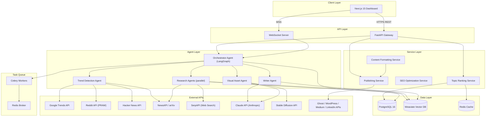
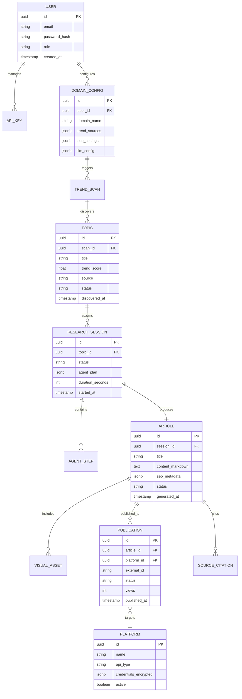

# High-Level Architecture: Cognify

## 1. Introduction
**Purpose**: Cognify is a self-driving content platform that monitors domains of interest, discovers trending topics automatically, runs multi-agent AI research, generates publication-ready long-form articles with charts and images, and publishes to multiple platforms — all without manual intervention.

**Scope**:
- In-scope: Trend discovery, multi-agent research, article generation, visual asset creation, multi-platform publishing, RAG-based knowledge management, SEO optimization
- Out-of-scope: Video/slide generation, multilingual support, collaborative editing (future enhancements)

**Target Audience**: Engineering team, AI coding agents, technical stakeholders

## 2. Architecture Overview

### Architecture Principles
- **Agent-first design**: All content generation flows through LangGraph multi-agent orchestration
- **Separation of concerns**: Agents, services, API, and data layers are fully decoupled
- **API-first**: All functionality exposed through documented FastAPI REST + WebSocket endpoints
- **Security by default**: Authentication and authorization on every endpoint; API keys encrypted
- **Observable**: Structured logging (structlog), metrics (Prometheus), and tracing (OpenTelemetry)
- **Testable**: Dependency injection via FastAPI Depends(), interface-based agent design, no hidden state

### Technology Stack

| Layer | Technology | Rationale |
|-------|-----------|-----------|
| Frontend | Next.js 15 + React 19 + TypeScript | Modern SSR dashboard with real-time WebSocket updates |
| Backend API | FastAPI (Python 3.12+) | Async-native, auto-generated OpenAPI docs, Pydantic validation |
| Agent Framework | LangChain + LangGraph | Mature multi-agent orchestration with stateful workflows |
| LLMs | Claude Opus 4 / Sonnet 4 | High-quality generation; Sonnet for drafts, Opus for final pass |
| Image Gen | Stable Diffusion XL | Open-source, self-hostable, high-quality illustrations |
| Vector DB | Weaviate | Hybrid search (vector + keyword), multi-tenancy, scalable |
| Database | PostgreSQL 16 | ACID transactions, JSONB for flexible metadata, proven at scale |
| Cache | Redis | Sub-ms latency for trend signal caching and rate limiting |
| Task Queue | Celery + Redis | Distributed background processing for long-running agent workflows |
| CI/CD | GitHub Actions | Native GitHub integration, matrix builds, container registry |
| Infrastructure | Docker + Kubernetes (AWS EKS) | Container orchestration, auto-scaling, rolling deployments |
| Monitoring | Prometheus + Grafana + OpenTelemetry | Full observability stack with dashboards and alerting |

## 3. Component Descriptions

### Orchestrator Agent (LangGraph)
- **Responsibility**: Receives topic selections, plans research strategy, spawns sub-agents, tracks state, merges results, triggers content generation
- **Interfaces**: Receives commands from FastAPI via Celery task queue; updates status via WebSocket; reads/writes agent state to PostgreSQL
- **Key patterns**: LangGraph StateGraph with conditional edges, checkpointing, and human-in-the-loop review gates

### Trend Detection Agent
- **Responsibility**: Polls external trend signal APIs (Google Trends, Reddit, HN, NewsAPI, arXiv), normalizes scores, ranks topics within configured domain
- **Interfaces**: Outputs ranked topic list to Orchestrator; caches raw signals in Redis (TTL: 15min)
- **Scheduling**: Runs on configurable cron (default: every 30 minutes)

### Research Agents (parallel)
- **Responsibility**: Execute web search, fetch documents, query knowledge base, perform literature review
- **Interfaces**: Receive research plan from Orchestrator; store findings in Weaviate vector DB; return structured summaries
- **Parallelism**: Multiple instances run concurrently on different facets of a topic

### Writer Agent
- **Responsibility**: Generates article outline, drafts sections using RAG context, applies SEO optimization, produces structured Markdown
- **Interfaces**: Reads from Weaviate (retrieved passages); outputs Markdown to Content Formatting Service

### Visual Asset Agent
- **Responsibility**: Generates charts (Matplotlib/Plotly), diagrams (Mermaid), and AI illustrations (Stable Diffusion)
- **Interfaces**: Receives data/prompts from Writer Agent; outputs image files + Markdown references

### Publishing Service
- **Responsibility**: Formats content for target platforms, manages API credentials, pushes posts, tracks publication state
- **Interfaces**: Ghost Admin API, WordPress REST API, Medium API, LinkedIn Marketing API
- **Features**: Scheduling, retry with backoff, publication status tracking

### API Gateway (FastAPI)
- **Responsibility**: Authentication, request validation, routing, rate limiting, CORS, correlation IDs
- **Interfaces**: REST endpoints for dashboard CRUD; WebSocket for real-time agent status

## 4. Data Architecture

### Data Flow
1. **Trend Discovery**: Cron triggers Trend Agent → polls external APIs → normalizes/ranks → stores Topics in PostgreSQL, caches raw signals in Redis
2. **Research**: Orchestrator picks top Topic → spawns Research Agents → agents fetch web/docs → index in Weaviate → store structured findings
3. **Generation**: Writer Agent retrieves RAG context from Weaviate → generates Markdown with citations → Visual Agent adds charts/images
4. **Publishing**: Formatting Service prepares platform-specific content → Publishing Service pushes via APIs → records Publication status

## 5. Integration Architecture

| External System | Protocol | Purpose | Auth Method |
|----------------|----------|---------|-------------|
| Google Trends API | HTTPS REST | Real-time search interest signals | API Key |
| Reddit (PRAW) | HTTPS REST | Trending posts and discussions | OAuth2 |
| Hacker News (Algolia) | HTTPS REST | Tech trend signals | None (public) |
| NewsAPI | HTTPS REST | Recent headlines by category | API Key |
| arXiv | HTTPS REST/RSS | Academic paper feeds | None (public) |
| SerpAPI | HTTPS REST | Web search for research agents | API Key |
| Anthropic (Claude) | HTTPS REST | LLM inference (primary + drafting) | API Key |
| Stable Diffusion | HTTPS REST | Image generation | API Key |
| Ghost | HTTPS REST | Blog publishing | Admin API Key + JWT |
| WordPress | HTTPS REST | Blog publishing | Application Password |
| Medium | HTTPS REST | Article publishing | Integration Token |
| LinkedIn Marketing | HTTPS REST | Article publishing | OAuth2 |

## 6. Infrastructure & Deployment
- **Environments**: Development (local Docker Compose) → Staging (AWS EKS) → Production (AWS EKS)
- **Deployment**: Containerized services via Docker; orchestrated on Kubernetes with Helm charts
- **Scaling**: Celery workers scale horizontally based on queue depth; FastAPI pods auto-scale on CPU/memory; Weaviate scales via sharding
- **Storage**: PostgreSQL on RDS (Multi-AZ), Redis on ElastiCache, Weaviate on dedicated EC2 instances, S3 for generated images

## 7. Security Architecture
- **Authentication**: JWT-based (RS256) with short-lived access tokens (15min) and refresh tokens (7d)
- **Authorization**: RBAC — roles: admin, editor, viewer; enforced at API middleware layer
- **Data Protection**: AES-256 encryption at rest (RDS, S3); TLS 1.3 in transit; API keys stored encrypted
- **Network**: VPC with private subnets for data layer; public subnets for ALB only; security groups per service
- **LLM Security**: Prompt sanitization, output content filters, cost-limiting rate controls

## 8. Non-Functional Requirements

| Requirement | Target | Measurement |
|-------------|--------|-------------|
| Trend scan latency | < 60 seconds per cycle | P95 duration metric |
| Research session | < 5 minutes per topic | P95 duration metric |
| Article generation | < 3 minutes per article | P95 duration metric |
| API response time | < 200ms (P95) | OpenTelemetry traces |
| Availability | 99.5% uptime | Uptime monitoring |
| Throughput | 50 articles/day | Daily article count |
| Data freshness | Trends updated every 30min | Cron monitoring |
| Recovery | RPO < 1 hour, RTO < 4 hours | DR drill results |

## 9. Architecture Decision Records
See [docs/architecture/adrs/](./adrs/) for all decisions.
- [ADR-001: LangGraph for Agent Orchestration](./adrs/ADR-001-langgraph-agent-orchestration.md)
