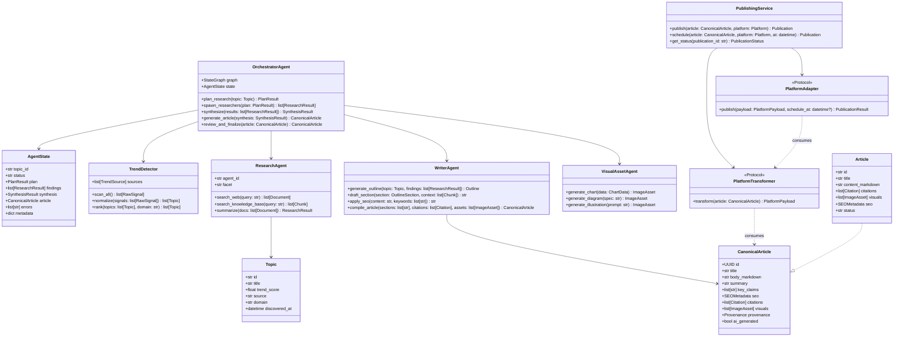
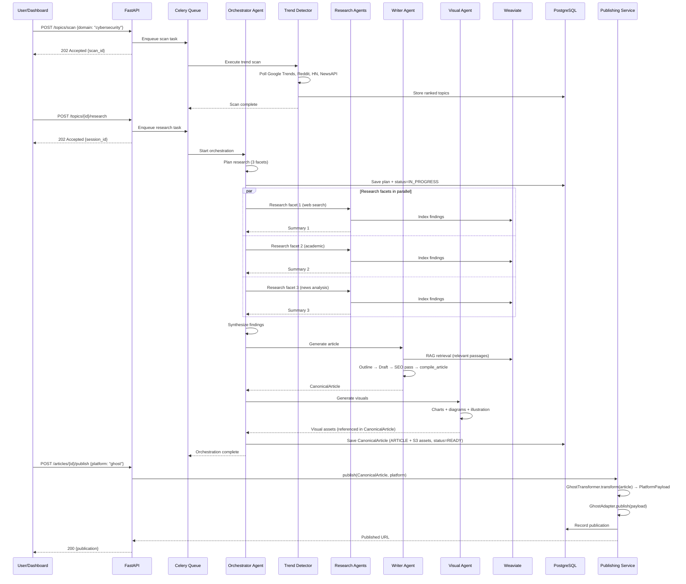

# Low-Level Design: Agent Orchestration & Content Pipeline

## 1. Overview
The agent orchestration system is Cognify's core — it coordinates trend detection, multi-agent research, content generation, and visual asset creation through a LangGraph StateGraph. Content generation produces a single **CanonicalArticle** (platform-neutral contract); publishing consumes it via **Platform Transformer** (pure: CanonicalArticle → PlatformPayload) and **Platform Adapter** (I/O: PlatformPayload → API) pairs per platform. See [ADR-003](../adrs/ADR-003-canonical-article-boundary.md) and [ADR-004](../adrs/ADR-004-publishing-transformer-adapter-pattern.md). This document details the internal design of the orchestrator, its agent interfaces, and the content pipeline.

## 2. Detailed Design


## 3. API Specifications

### Topics API

| Method | Path | Description | Auth | Request | Response |
|--------|------|-------------|------|---------|----------|
| GET | `/api/v1/topics` | List discovered topics | JWT | `?domain=&status=&cursor=&limit=` | `TopicListResponse` |
| GET | `/api/v1/topics/{id}` | Get topic details | JWT | - | `TopicResponse` |
| POST | `/api/v1/topics/scan` | Trigger manual trend scan | JWT (admin) | `{ "domain": str, "sources": list[str] }` | `ScanResponse` |
| POST | `/api/v1/topics/{id}/research` | Start research on topic | JWT | `{ "depth": str, "max_agents": int }` | `ResearchSessionResponse` |

### Articles API

| Method | Path | Description | Auth | Request | Response |
|--------|------|-------------|------|---------|----------|
| GET | `/api/v1/articles` | List generated articles | JWT | `?status=&cursor=&limit=` | `ArticleListResponse` |
| GET | `/api/v1/articles/{id}` | Get article with content | JWT | - | `ArticleResponse` |
| POST | `/api/v1/articles/{id}/publish` | Publish to platform | JWT | `{ "platform_id": str, "schedule_at": datetime? }` | `PublicationResponse` |
| PATCH | `/api/v1/articles/{id}` | Update article (edit draft) | JWT | `{ "title": str?, "content_markdown": str? }` | `ArticleResponse` |
| DELETE | `/api/v1/articles/{id}` | Delete article | JWT (admin) | - | `204 No Content` |

### Research API

| Method | Path | Description | Auth | Request | Response |
|--------|------|-------------|------|---------|----------|
| GET | `/api/v1/research` | List research sessions | JWT | `?status=&cursor=&limit=` | `ResearchListResponse` |
| GET | `/api/v1/research/{id}` | Get session with agent steps | JWT | - | `ResearchDetailResponse` |
| GET | `/api/v1/research/{id}/stream` | WebSocket: real-time status | JWT | - | SSE/WS stream of `AgentStepEvent` |

### Publishing API

| Method | Path | Description | Auth | Request | Response |
|--------|------|-------------|------|---------|----------|
| GET | `/api/v1/platforms` | List connected platforms | JWT | - | `PlatformListResponse` |
| POST | `/api/v1/platforms` | Add publishing platform | JWT (admin) | `{ "name": str, "api_type": str, "credentials": dict }` | `PlatformResponse` |
| GET | `/api/v1/publications` | List publications | JWT | `?platform=&cursor=&limit=` | `PublicationListResponse` |

### Settings API

| Method | Path | Description | Auth | Request | Response |
|--------|------|-------------|------|---------|----------|
| GET | `/api/v1/settings` | Get user settings | JWT | - | `SettingsResponse` |
| PUT | `/api/v1/settings` | Update settings | JWT | `SettingsUpdateRequest` | `SettingsResponse` |
| GET | `/api/v1/settings/api-keys` | List API key metadata | JWT | - | `ApiKeyListResponse` |
| POST | `/api/v1/settings/api-keys` | Add API key | JWT | `{ "name": str, "service": str, "key": str }` | `ApiKeyResponse` |

## 4. Data Model

### Topic
```python
class Topic(SQLModel, table=True):
    id: uuid.UUID = Field(default_factory=uuid4, primary_key=True)
    scan_id: uuid.UUID = Field(foreign_key="trend_scan.id")
    title: str = Field(max_length=500)
    description: str | None = Field(default=None, max_length=2000)
    trend_score: float = Field(ge=0.0, le=100.0)
    source: str = Field(max_length=100)  # google_trends, reddit, hackernews
    domain: str = Field(max_length=200)
    status: TopicStatus = Field(default=TopicStatus.NEW)
    metadata_json: dict = Field(default_factory=dict, sa_type=JSONB)
    discovered_at: datetime = Field(default_factory=datetime.utcnow)
```

### Article (persists CanonicalArticle contract)
The `Article` table persists the **CanonicalArticle** contract (see [ADR-003](../adrs/ADR-003-canonical-article-boundary.md)). Schema may be extended with `summary`, `key_claims`, `provenance`, `ai_generated`, etc., as the CanonicalArticle model is implemented.

```python
class Article(SQLModel, table=True):
    id: uuid.UUID = Field(default_factory=uuid4, primary_key=True)
    session_id: uuid.UUID = Field(foreign_key="research_session.id")
    title: str = Field(max_length=500)
    content_markdown: str
    word_count: int = Field(ge=0)
    seo_metadata: dict = Field(default_factory=dict, sa_type=JSONB)
    status: ArticleStatus = Field(default=ArticleStatus.DRAFT)
    generated_at: datetime = Field(default_factory=datetime.utcnow)
    updated_at: datetime = Field(default_factory=datetime.utcnow)
```

### ResearchSession
```python
class ResearchSession(SQLModel, table=True):
    id: uuid.UUID = Field(default_factory=uuid4, primary_key=True)
    topic_id: uuid.UUID = Field(foreign_key="topic.id")
    status: SessionStatus = Field(default=SessionStatus.QUEUED)
    agent_plan: dict = Field(default_factory=dict, sa_type=JSONB)
    agent_steps: list[dict] = Field(default_factory=list, sa_type=JSONB)
    sources_used: int = Field(default=0)
    embeddings_created: int = Field(default=0)
    duration_seconds: int | None = None
    started_at: datetime | None = None
    completed_at: datetime | None = None
```

## 5. Business Logic

### Trend Scoring Algorithm
1. Fetch raw signals from each source (volume, velocity, recency)
2. Normalize scores to 0-100 scale per source
3. Apply domain relevance filter (keyword matching + semantic similarity)
4. Weight by source reliability: Google Trends (0.3), Reddit (0.2), HN (0.2), News (0.2), arXiv (0.1)
5. Deduplicate similar topics (cosine similarity > 0.85 → merge)
6. Rank by composite score; top N topics surfaced for research

### Agent Orchestration Flow
1. Orchestrator receives topic → creates research plan (3-5 facets)
2. For each facet, spawn a ResearchAgent in parallel via Celery
3. Each agent: web search → fetch docs → chunk → embed in vector DB → summarize
4. Orchestrator waits for all agents (timeout: 5min) → collects results
5. Synthesis: merge findings, resolve conflicts, rank by citation quality
6. Writer Agent: outline → draft per section (RAG retrieval) → SEO pass → **compile_article** produces **CanonicalArticle** (persisted to DB + S3). Content generation has no knowledge of publishing platforms.
7. Visual Agent: generate charts for data mentions, diagrams for concepts, illustration for hero image; assets are referenced in the CanonicalArticle.
8. Review gate: automated quality check (readability, citation count, SEO score)
9. If quality threshold met → status = READY (CanonicalArticle stored). **Publishing**: when user requests publish, Publishing Service loads CanonicalArticle → runs **Platform Transformer** (CanonicalArticle → PlatformPayload; pure, no I/O) → **Platform Adapter** (PlatformPayload → external API). Service owns retries, scheduling, credentials, and publication state ([ADR-004](../adrs/ADR-004-publishing-transformer-adapter-pattern.md)).

### SEO Optimization Rules
- Title: 50-60 chars, primary keyword in first 30 chars
- Meta description: 150-160 chars, includes CTA
- H1 matches title; H2s contain secondary keywords
- Keyword density: 1-2% for primary keyword
- Internal linking: suggest 2-3 related articles
- Image alt text: descriptive, includes keyword where natural

## 6. Error Handling
- Use structured error types with error codes (e.g., `AGENT_TIMEOUT`, `LLM_RATE_LIMIT`)
- All errors logged with correlation ID via structlog
- Client-facing errors never expose internals (generic message + error code)
- Retry with exponential backoff for transient failures (LLM API, external APIs)
- Circuit breaker pattern for external API calls (fail-fast after 5 consecutive failures)
- Dead letter queue for permanently failed agent tasks (manual review)

## 7. Sequence Diagrams

### End-to-End Article Generation Flow

