# CI/CD Pipeline: Cognify

## 1. Pipeline Overview

```mermaid
graph LR
    subgraph "CI — Pull Request"
        A[Lint + Format] --> B[Unit Tests]
        B --> C[Integration Tests]
        C --> D[SAST + Secret Scan]
        D --> E[Coverage Report]
    end
    subgraph "CD — Merge to main"
        F[E2E Tests] --> G[Build Docker Images]
        G --> H[Push to ECR]
        H --> I[Deploy to Staging]
        I --> J[Smoke Tests]
        J --> K[Manual Approval]
        K --> L[Deploy to Production]
        L --> M[Health Check]
    end
    E --> F
```



## 2. CI Stages (Pull Request)

### Stage 1: Lint & Format (< 30s)
```yaml
- ruff check src/ tests/
- ruff format --check src/ tests/
- mypy src/ --strict
- prettier --check "frontend/**/*.{ts,tsx,json}"
- eslint frontend/
```
**Gate**: All checks must pass. No PR merge with lint errors.

### Stage 2: Unit Tests (< 60s)
```yaml
- pytest tests/unit/ -v --cov=src --cov-report=xml --tb=short
```
**Gate**: All tests pass. Coverage on new code ≥ 80%.

### Stage 3: Integration Tests (< 5min)
```yaml
services:
  - postgres:16
  - redis:7
  - milvus/milvus:latest
steps:
  - pytest tests/integration/ -v --tb=short
```
**Gate**: All tests pass. Uses TestContainers for real database validation.

### Stage 4: Security Scans (< 2min)
```yaml
- bandit -r src/ -f json -o bandit-report.json
- semgrep --config auto src/
- detect-secrets scan --all-files --exclude-files "tests/"
- pip-audit --strict
```
**Gate**: Zero Critical or High findings. Secrets detected = automatic PR block.

### Stage 5: Coverage Report
```yaml
- coverage combine
- coverage report --fail-under=70
- Post coverage diff as PR comment
```
**Gate**: Overall coverage ≥ 70%. New code coverage ≥ 80%.

## 3. CD Stages (Merge to main)

### Stage 6: E2E Tests (< 10min)
```yaml
- docker compose -f docker-compose.test.yml up -d
- playwright test tests/e2e/
- docker compose -f docker-compose.test.yml down
```
**Gate**: All critical user journeys pass.

### Stage 7: Build & Push Docker Images
```yaml
- docker build -t cognify-api:${SHA} -f Dockerfile.api .
- docker build -t cognify-worker:${SHA} -f Dockerfile.worker .
- docker build -t cognify-frontend:${SHA} -f Dockerfile.frontend .
- Push to AWS ECR with tags: ${SHA}, latest
```

### Stage 8: Deploy to Staging
```yaml
- helm upgrade --install cognify ./helm/cognify \
    --namespace staging \
    --set image.tag=${SHA} \
    --values helm/values-staging.yaml
- kubectl rollout status deployment/cognify-api -n staging --timeout=5m
```

### Stage 9: Staging Smoke Tests
```yaml
- curl -f https://staging.cognify.app/api/v1/health
- pytest tests/smoke/ --base-url=https://staging.cognify.app
```
**Gate**: Health endpoint returns 200. Smoke tests pass.

### Stage 10: Manual Approval Gate
- Slack notification to #deployments channel
- Requires approval from engineering lead
- Auto-expires after 24 hours

### Stage 11: Production Deployment
```yaml
- helm upgrade --install cognify ./helm/cognify \
    --namespace production \
    --set image.tag=${SHA} \
    --values helm/values-production.yaml
- kubectl rollout status deployment/cognify-api -n production --timeout=5m
```
**Strategy**: Rolling update with maxUnavailable=0, maxSurge=1 (zero-downtime).

### Stage 12: Production Health Check
```yaml
- curl -f https://api.cognify.app/api/v1/health
- Monitor error rate in Grafana for 15 minutes
- Auto-rollback if error rate > 5%
```

## 4. Branch Strategy

| Branch | Purpose | CI | CD |
|--------|---------|----|----|
| `feature/*` | Feature development | Full CI on push | — |
| `fix/*` | Bug fixes | Full CI on push | — |
| `main` | Production-ready code | Full CI + E2E | Auto-deploy to staging, manual gate to prod |
| `release/*` | Release candidates | Full CI + E2E | Deploy to staging for validation |

## 5. Environment Variables & Secrets

| Secret | CI | Staging | Production |
|--------|----|---------| -----------|
| `ANTHROPIC_API_KEY` | FakeLLM (not needed) | GitHub Secrets | AWS Secrets Manager |
| `DATABASE_URL` | TestContainers (auto) | GitHub Secrets | AWS Secrets Manager |
| `REDIS_URL` | TestContainers (auto) | GitHub Secrets | AWS Secrets Manager |
| `AWS_ECR_REGISTRY` | GitHub Secrets | — | — |

## 6. Deployment Checklist (per release)

- [ ] All CI checks green on main
- [ ] E2E tests passing
- [ ] No Critical/High SAST findings
- [ ] Secret scan clean
- [ ] Staging smoke tests pass
- [ ] Database migration tested on staging
- [ ] Monitoring dashboards reviewed
- [ ] Rollback plan documented
- [ ] Engineering lead approved

## 7. Rollback Procedure
1. **Automated**: If error rate > 5% within 15 minutes post-deploy, Kubernetes auto-rolls back
2. **Manual**: `helm rollback cognify -n production` to previous revision
3. **Database**: Alembic `downgrade -1` for reversible migrations; irreversible migrations require hotfix branch
